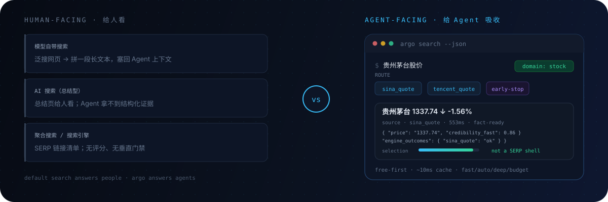

<p align="center">
  
</p>

<p align="center">
  <a href="README.md">中文</a> ·
  <a href="README.en.md">English</a> ·
  <a href="README.ja.md">日本語</a> ·
  <a href="README.ko.md">한국어</a> ·
  <strong>Español</strong>
</p>

<p align="center">
  <a href="#qué-es">Intro</a> ·
  <a href="#por-qué-supera-a-la-búsqueda-del-modelo-la-búsqueda-ia-y-el-metasearch">Comparar</a> ·
  <a href="#enrutamiento-según-la-consulta">Prueba</a> ·
  <a href="#cómo-funciona">Mecanismo</a> ·
  <a href="#inicio-rápido">Inicio rápido</a> ·
  <a href="#capacidades">Capacidades</a> ·
  <a href="#instalación-y-configuración">Config</a> ·
  <a href="#historial-de-cambios">Actualizaciones</a>
</p>

<p align="center">
  
  
  
  
  
</p>

---

## Destacados de v2.8.4 (sobre v2.8.3)

> En una frase: esta versión lleva más lejos el «encontrártelo» — **los datos locales de primera mano entran en la investigación**, **enganchar MCP en varios agentes es un comando**, **las preguntas simples ya no se arrastran a rondas extra**, **una fuente de búsqueda gratis más**, y algunos endurecimientos de seguridad.

- **La investigación profunda puede comer tus datos locales**: los work packages admiten `file_inputs` (CSV / XLSX / literatura de primera mano; se registra el hash, no el contenido) + `recompute` (recalc en sandbox; los desajustes se marcan)
- **El MCP ya no se edita a mano**: `argo mcp inject` escribe Claude Code / Cursor / Windsurf / Codex / OpenCode / Cline (escritura atómica + backup + deshacer)
- **Las consultas simples se quedan baratas**: normalización (ancho completo→medio, barras de versión) + puerta de complejidad (lo simple no pasa a multi-fuente cara) + sintaxis social/plataforma primero + si se descarta un motor chino, se siguen mirando candidatos
- **Keenable** como fuente web en prueba gratis (desactívala si termina la prueba)
- **Seguridad**: recompute bloquea subprocesos de salida a red; las rutas de host son conscientes de la instalación (sin `~/.agents` hardcodeado); la pista de instalación ya no apunta al paquete npm obsoleto

> Detalle al final: [historial](#historial-de-cambios) y [notas de release](docs/RELEASE_NOTES_v2.8.4.md).

---

## Por qué supera a la búsqueda del modelo, la búsqueda IA y el metasearch

> En corto: las tres primeras ayudan a **personas** a encontrar información. Argo ayuda a **agentes** a buscar y verificar en un mismo pipeline. La diferencia no es la interfaz, es el entregable: página de resumen o lista de enlaces para humanos frente a evidencia ordenable, re-verificable y que no hincha el contexto.

<p align="center">
  
</p>

| Dimensión | Búsqueda del modelo | Búsqueda IA (resúmenes) | Metasearch / motores | **Argo** |
|-----------|---------------------|-------------------------|----------------------|----------|
| Forma del resultado | Texto largo cosido | Página de resumen humana | Lista de enlaces SERP | **JSON compacto: candidatos de evidencia + desglose de credibilidad** |
| Preguntas verticales (cotizaciones / fórmulas) | Web genérica | Web genérica y luego resumen | Web genérica | **Fuentes verticales directas, en forma de respuesta** |
| Credibilidad de evidencia | Sin puntuación | Sin puntuación estructurada | Sin puntuación | **selection · absorption · freshness · consenso** |
| Consultas repetidas | Red cada vez | Red cada vez | Caché de página | **Caché de dos capas (memoria + SQLite); consultas calientes ~10 ms** |
| Control de coste | Incontrolable | Caro por llamada | Gratis pero trabajoso | **Modos de presupuesto; gratis primero; claves todas opcionales** |
| Multilingüe | Sigue al modelo | Sigue al modelo | Sigue al motor | **Detección de idioma + params de locale + enrutamiento multilingüe** |

> Mecánicamente, Argo trata la búsqueda como un **pipeline de evidencia**: detectar idioma → enrutar dominio → recall multi-motor → fusionar RRF → ojeada de evidencia. El agente puede ordenar, `fetch` para verificar y mantener el material dentro del contexto.

---

## Qué es

**Argo es infraestructura de búsqueda multilingüe para agentes de IA.**

La recuperación real nunca es «un idioma + un cuadro de búsqueda»: alguien pregunta por cotizaciones de acciones A, alguien más por el Mundial, alguien busca anime en japonés, alguien quiere el director de una película en IMDb. La premisa de Argo es simple: **enrutar por dominio, idioma e intención** hacia las fuentes adecuadas, en lugar de siempre raspado genérico de títulos web. La búsqueda en la red y la de archivos locales funcionan juntas.

> El resultado no es una «lista de enlaces», sino **candidatos de evidencia + desglose de credibilidad**. Un buen enrutamiento es lo que hace que la evidencia se sostenga.

### frente a «envolver otra API de búsqueda»

| Enfoque habitual | Argo |
|-----------------|------|
| Atado a un motor y una clave | Multi-motor con enrutamiento automático; gratis primero, con presupuesto |
| Toda consulta es búsqueda web genérica | **Fuentes verticales primero**: mercados, cine, deportes, macro, química… resultados en forma de respuesta |
| Optimizado solo para chino/inglés | **Detección de idioma + parámetros de locale + fallback interlingüístico** |
| Resumir snippets y listo | Selección × densidad de evidencia × frescura × consenso multi-fuente |
| Un motor caído tumba la cadena | Cortacircuitos, caché negativa, recuperación por etapas (sin contaminación vertical) |
| Red en cada consulta | Caché de dos capas (memoria + SQLite); consultas calientes ~10 ms |
| Misma ruta lenta para diario e investigación | **Menos motores en el día a día; más abiertos en investigación profunda** |
| JSON largo agota el contexto del agente | Respuestas MCP compactas; snippets controlables |

---

## Enrutamiento según la consulta

<p align="center">
  
</p>

| Preguntas así | Lo que suele ocurrir |
|---------|----------------------|
| 贵州茅台股价 | Dominio de cotizaciones A-share; fuentes snapshot primero; early-stop si basta |
| AAPL / US pre-market | Dominio de acciones EE. UU., separado de A-shares |
| 肖申克的救赎 主演 / Inception director | Dominio cine → IMDb etc. |
| 梅西 俱乐部 / 库里 球队 | Dominio deportes → TheSportsDB etc. |
| 埃菲尔铁塔在哪 / where is Eiffel Tower | Entidad geo → OpenStreetMap etc. |
| NASA founding year / 国务院职能 | Entidad org → Wikidata etc. |
| 周杰伦 专辑 / Taylor Swift album | Dominio media → iTunes etc. |
| アニメ おすすめ / 한국 영화 추천 | Detecta JA/KO → fuentes amigables al idioma; evita sitios solo en chino |
| US CPI, China GDP | Dominio macro; separa por país |
| 阿司匹林 分子式 | Química → respuestas tipo PubChem |
| TSMC valuation debate (deep research) | Subpreguntas + fuentes en paralelo; verticales reforzados |

---

## Cómo funciona

<p align="center">
  
</p>

```
query
  ├─ intent clarify (optional)
  ├─ query rewrite (optional; routing still sees original intent)
  ├─ language detect + language preference
  ├─ route (domain rules + TF-IDF + budget + lang supplements + hot-path cache)
  ├─ multi-engine recall (circuit breaker / negative cache / parallel)
  ├─ staged empty-result recovery (widen → same family/general → cross-lang; anti-pollution)
  ├─ RRF fusion + optional re-rank
  ├─ evidence skim (authority · density · freshness · consensus)
  └─ unified JSON (incl. engine_outcomes / recovery)
```

### Puntuación de evidencia (resumen)

```
selection  ≈ domain authority; SERP / redirect shells ranked very low
absorption ≈ density of numbers / definitions / comparisons / disclosures
freshness  ≈ publish time (ignores historical comparison years like “since 2015”)
composite  ≈ 0.40·selection + 0.35·absorption + 0.15·freshness + 0.10·engine score
```

Los resultados incluyen `selection`, `absorption`, `credibility_fast`, `evidence_flags`, etc. para que el agente ordene directamente.

### Disciplina del agente (recomendada)

1. **Preguntas de alto riesgo** (posiciones, seguridad, «¿es cierto?»): buscar → leer puntuaciones rápidas → `fetch` de los top → luego concluir  
2. **Números**: declarar el口径 (definición/alcance); si las fuentes chocan, listarlas—no forzar fusión  
3. **Páginas SERP / redirección**: nunca como fuente primaria  
4. **Posts sociales**: sentimiento y narrativa, no verdad de fondo  
5. **Fact-check**: preferir pocas consultas estratificadas (fuente / comparación / sujeto)

---

## Inicio rápido

Elige cualquier camino. **GitHub es la única fuente de verdad de instalación** (`npx github:taxueseek/argo` o `install.sh`); recomendación actual **v2.8.4**. **No uses `npm install argo-search`** — la copia del registro npm es un **v1.0.1 no oficial y obsoleto** (no es este repo, incompleto, no se actualiza). Este paquete pone `private: true` para no publicarse en npm por error.

**Funciona sin configuración**: sin claves API corren motores gratis + `local_*` locales; los que requieren clave se omiten si faltan (y suelen mejorar cuando están).

### Opción 1: Script de instalación (mejor para uso local a largo plazo)

```bash
curl -fsSL https://raw.githubusercontent.com/taxueseek/argo/main/scripts/install.sh | bash
```

Home personalizado + enlace de Skill:

```bash
curl -fsSL https://raw.githubusercontent.com/taxueseek/argo/main/scripts/install.sh \
  | bash -s -- --home "$HOME/.local/share/argo" --link "$HOME/.claude/skills/argo"
```

Verificar:

```bash
python3 ~/.local/share/argo/scripts/search.py "贵州茅台股价" --json
python3 ~/.local/share/argo/scripts/search.py --list-engines
```

### Opción 2: MCP desde GitHub (enganche rápido del agente)

Necesita **Node.js 18+** y **Python 3.10+**. Una vez:

```bash
pip3 install pyyaml
```

```bash
npx -y github:taxueseek/argo
```

Config del cliente (Claude Code / Cursor / Kimi, etc.):

```json
{
  "mcpServers": {
    "argo": {
      "command": "npx",
      "args": ["-y", "github:taxueseek/argo"]
    }
  }
}
```

Más estable, sin Node: instala con la opción 1 y apunta a Python local:

```json
{
  "mcpServers": {
    "argo": {
      "command": "python3",
      "args": ["/path/to/argo/scripts/mcp_server.py"]
    }
  }
}
```

Ruta de Python inusual: `export ARGO_PYTHON=/path/to/python3` (solo lo lee la entrada npx).

### Plugin de una línea para DeepSeek Harness

Dos caminos dentro de DeepSeek Harness:

```bash
# A: 12 herramientas mcp__argo__* (bundle del paquete principal, igual que el MCP completo)
dsh plugin --profile web add "github:taxueseek/argo"

# B: herramientas de búsqueda + orquestación wide_research (subpaquete)
dsh plugin --profile web add "github:taxueseek/argo#main&path:packages/dsh-plugin"
```

Reinicia `dsh web` tras instalar. Ver `packages/dsh-plugin/`.

### Opción 3: Tarball de release

Abre [Releases](https://github.com/taxueseek/argo/releases), descarga **`argo-2.8.4.tar.gz`**:

```bash
tar -xzf argo-2.8.4.tar.gz
cd argo-2.8.4
pip3 install pyyaml
python3 scripts/search.py "Python asyncio" --json
python3 scripts/mcp_server.py
```

### Opción 4: git clone (dev / parchear fuente)

```bash
git clone https://github.com/taxueseek/argo.git
cd argo
pip3 install pyyaml
bash scripts/install.sh --link ~/.claude/skills/argo   # optional
python3 scripts/search.py --list-engines
```

### Opción 5: Directorio Skill (symlink, una sola fuente de verdad)

```bash
python3 scripts/link_source.py --to ~/.claude/skills/argo
python3 scripts/link_source.py --to ~/.agents/skills/argo

cp installs.local.yaml.example installs.local.yaml
python3 scripts/link_source.py
python3 scripts/link_source.py --check
```

### Opción 6: Biblioteca Python

```python
import sys
sys.path.insert(0, "/path/to/argo/scripts")
from search import super_search

result = super_search("Python asyncio", n=5, mode="fast")
for item in result["results"]:
    print(item["title"], item.get("credibility_fast"), item["url"])
```

```bash
# if bin/argo is on PATH
argo search "Python asyncio"
argo research "2026 mutual fund holdings structure"
argo evidence "a claim to verify"
```

---

## Plataformas

| Plataforma | Integración | Notas |
|----------|-------------|-------|
| **Claude Code** | MCP / enlace Skill | `npx` o `mcp_server.py`; `link_source.py` ok |
| **Kimi / Grok Build** | MCP Server | igual |
| **Cursor / Cline / Continue** | MCP | cualquier plugin IDE con MCP |
| **CLI** | `search.py` / `bin/argo` | scripts, cron, debug manual |
| **Proyectos Python** | `from search import super_search` | llamada de librería |

### Comprobación post-instalación

```bash
python3 --version          # 3.10+
python3 -c "import yaml; print('PyYAML OK')"
python3 -m pytest tests/test_unit.py -q   # optional
python3 scripts/search.py --list-engines
```

---

## Capacidades

| Capacidad | Qué hace | Entrada |
|------------|--------------|-------|
| Búsqueda unificada | route → recall → fuse → skim score | `search.py` / `argo_search` |
| Búsqueda de archivos locales | código/notas/memoria en disco (offline) | `argo_local_search` |
| Vista previa de texto local | preview en dirs en whitelist (fail-closed) | `argo_local_read` |
| Recompute | recálculo numérico en sandbox (niega por defecto) | `argo_recompute` |
| Investigación profunda | subpreguntas, multi-fuente, pistas de huecos | `research.py` / `argo_research` |
| Credibilidad | autoridad / densidad / frescura / cruce | `evidence.py` / `argo_evidence` |
| Aclarar intención | polisemia, colisiones de marca, pistas de estrategia | `clarify.py` / `argo_clarify` |
| Fetch de página | HTTP primero, navegador si hace falta | `argo_fetch` (`mode=extract` para estructura) |
| Captura / PDF | capturas de página, extracto PDF estructurado | `argo_screenshot` / `argo_pdf` |
| Crawl de sitio | crawl por lotes de páginas de listado | `argo_crawl` |
| Social / sentimiento | Weibo / Xiaohongshu / Bilibili / Reddit / X … | `argo_social_search` |

### Modos de presupuesto

| Modo | Mejor para | Comportamiento |
|------|----------|----------|
| `fast` | Q simple, necesita velocidad | motores gratis primero; omite re-rank de pago |
| `auto` | default diario | equilibrio calidad/gasto con conciencia de coste |
| `deep` | investigación, sondeos | calidad primero; más motores |
| `budget` | cuota justa | control de cuota; degrada al agotarse |

### Conjunto aproximado de capacidades (v2.8.4)

- **Fusión de datos locales (nuevo en v2.8.4)**: work packages de investigación con `file_inputs` (datos locales de primera mano; se registra sha256/linaje) + `recompute` (recálculo en sandbox); el dossier emite `local_sources`
- **Inyección MCP de un comando (nuevo en v2.8.4)**: `argo mcp inject` para Claude Code / Cursor / Windsurf / Codex / OpenCode / Cline (escritura atómica + backup + deshacer; fuente `mcp/clients.yaml`)
- **Mejoras de búsqueda estructurada (nuevo en v2.8.4)**: normalización + variantes + puerta de complejidad; sintaxis social primero; TF-IDF sigue mirando tras descartar un motor chino; `--include-local`
- **Keenable (nuevo en v2.8.4)**: motor web general extra (HTTP declarativo L1, prueba gratis, `ARGO_KEENABLE_API_KEY`)
- **~150+ fuentes, 70+ dominios**: web general + finanzas / macro / cine / deportes / geo / orgs / media / química / academia / código (fuente de verdad: `config.yaml`)
- **12 herramientas MCP**: search, research, evidence, clarify, fetch, screenshot, PDF, social, archivos locales, crawl, preview local, recompute
- **Búsqueda multilingüe**: chino, inglés, japonés, coreano, cirílico, tailandés, árabe, hebreo, griego, devanagari, …; el enrutamiento y los params de motor siguen el idioma; consultas no chinas evitan fuentes solo en chino (Zhihu / Sogou WeChat / snapshots A-share, etc.)
- **Compuertas de recuperación vertical**: la recuperación de vacío no «filtra» pypi / npm / flash news a cine o deportes
- **Más rápido en el día a día, más completo en investigación**: tiers `engine_policy`—combo diario apretado, long-tail abierto para deep / research

---

## Motores y enrutamiento

La config tiene ahora unos **150+** fuentes y **70+** dominios (ver `config.yaml` y `--list-engines`).

### Directos y verticales (extracto)

| Motor | Escenario | Sesgo de coste |
|--------|----------|-----------|
| anysearch / duckduckgo | general / tech | free |
| sina_quote / tencent_quote / eastmoney | cotizaciones A-share / flujos | free |
| finviz / seeking_alpha | finanzas EE. UU. y exterior | depends |
| imdb / itunes / thesportsdb | cine / música / deportes | mostly free |
| local_openstreetmap / wikidata / wikipedia | geo / org / enciclopedia | free |
| arxiv / semantic_scholar / openalex | académico | mostly free |
| pubchem / gbif / rfc_editor | química / especies / estándares | free |
| github / stackoverflow / pypi / npm | código y paquetes | depends |
| byted / bocha / metaso / octen | web china / búsqueda IA | API / low cost |
| zhihu / wechat_sogou | opinión china / WeChat | API / free |
| tavily / felo / exa | internacional / semántica | paid or quota |
| twitter / reddit / xiaohongshu / bilibili / weibo | social UGC | free (some need login) |

### Capa local de coste cero (`local_*`)

No hace falta un servicio SearXNG aparte. La ruta principal usa parseo in-process de HTML / RSS / JSON (`local_bing`, `local_sogou`, `local_google`, `local_arxiv`, …). En **consultas multilingües**, el enrutamiento reescribe params de idioma del motor (p. ej. Bing `setlang`) y fusiona con RRF.

---

## Ejemplos

### Finanzas

```bash
python3 scripts/search.py "贵州茅台股价" --explain
# typical: stock_query → quote snapshot sources
```

### Académico

```bash
python3 scripts/search.py "transformer attention mechanism paper" --json
# domain often academic; combo includes arxiv etc.
```

### Investigar y verificar

```bash
python3 scripts/research.py "2026 mutual fund Q2 holdings structure" --depth deep --json

python3 scripts/search.py "same query" --json | \
  python3 scripts/evidence.py "same query" --stdin --json
```

### Herramientas MCP (12)

| Herramienta | Propósito |
|------|---------|
| `argo_search` | búsqueda unificada |
| `argo_local_search` | archivos locales (offline) |
| `argo_local_read` | preview de texto local en whitelist (fail-closed) |
| `argo_recompute` | recálculo en sandbox (niega por defecto; hace falta auth) |
| `argo_research` | investigación profunda (incl. modo sentimiento social) |
| `argo_evidence` | puntuación de credibilidad |
| `argo_clarify` | desambiguación de intención |
| `argo_fetch` | fetch inteligente (`mode=extract` extracto estructurado) |
| `argo_crawl` | crawl de sitio |
| `argo_screenshot` | captura de página |
| `argo_pdf` | extracto PDF |
| `argo_social_search` | social multi-plataforma (`mode=sentiment`) |

---

## Instalación y configuración

### Requisitos

| Ítem | Requisito |
|------|-------------|
| Python | 3.10+ (CLI + núcleo MCP) |
| Deps | `pip install pyyaml` (única dependencia dura) |
| Node.js | **solo** para entrada `npx`, 18+ |
| SearXNG | no requerido (motores locales integrados) |

### Claves API (todas opcionales)

Sin clave se omite ese motor; los gratis sostienen. **Usa variables de entorno**—nunca commits de claves reales ni pegarlas en issues.

```bash
# recommended (better quality)
export TAVILY_API_KEY="your_key"
export BOCHA_API_KEY="your_key"
export METASO_API_KEY="your_key"
export ZHIHU_ACCESS_SECRET="your_key"

# optional
export BRAVE_API_KEY="your_key"
export FELO_API_KEY="your_key"
export GITHUB_TOKEN="your_key"
export WEB_SEARCH_API_KEY="your_key"
export ANYSEARCH_API_KEY="your_key"
export OCTEN_API_KEY="your_key"
export ARGO_KEENABLE_API_KEY="your_key"   # opcional; prueba gratis de Keenable
```

`config.yaml` solo guarda placeholders `{ENV_NAME}`—sin secretos en claro en git.

### Caché

La ruta SQLite por defecto es `cache.db_path` en `config.yaml` (suele ser `~/.cache/unified-search/cache.db`).

| Tipo | TTL aprox. |
|------|-------------|
| Finance | ~5 min |
| News / realtime | ~10–15 min |
| General | ~1 hour |
| Research / evergreen | ~2–24 hours |
| Empty results | very short (avoid freezing “no hits”) |

### FAQ

**¿Funciona sin claves API?**  
Sí. Muchos motores locales gratis y APIs gratis; la ruta sin clave es automática.

**¿Script de instalación vs npx?**  
Script: instalación local fija, config, enlace Skill. npx: enganchar MCP rápido. Mismo núcleo Python.

**¿Cómo ver los motores?**  
`python3 scripts/search.py --list-engines`, o añade `--explain`.

**¿Varias copias de código en el repo?**  
No. Prefiere una fuente + symlinks con `link_source.py`, no clones rsync.

---

## Flags CLI

```
python3 scripts/search.py [options] query

  --engine, -e       engine, default auto
  --max-results, -n  count, default 5
  --depth, -d        fast | balanced | deep
  --mode             fast | auto | deep | budget
  --no-cache         skip cache
  --explain          print routing explanation
  --json             JSON output
  --timeout, -t      timeout seconds
  --list-engines     list engines
```

---

## Compromisos de diseño

1. **Absorción del agente primero, cantidad de enlaces segundo.**  
2. **Gratis y local primero; de pago es elevación opcional.**  
3. **Los fallos son observables**: empty / timeout / breaker van etiquetados—sin tragar en silencio.  
4. **Motores guiados por config**; `config.yaml` es la única fuente de verdad.  
5. **Instalación de fuente única**: enlaza entradas, no rsync de copias.  
6. **Lo social no es una biblioteca de verdad**; sirve para expansión y sentimiento, no como única base factual.

---

## Buenos encajes

- Backend de búsqueda para agentes Claude Code / Grok Build / Codex / Kimi  
- Q&A **multilingüe y multi-dominio**: CJK + EN + finanzas / cine / deportes / academia / código  
- Scripts y pipelines que necesitan recuperación **reproducible y cacheable**  
- Fact-check y comparación multi-fuente de datos públicos de finanzas / entidades  

No es gran solución única para: ranking nativo de engagement de plataforma, o agregadores max-recall de larga vida (los motores locales embebidos reemplazan SearXNG externo como vía principal).

---

## Árbol (resumen)

```
argo/
├── README.md                # Chinese (default)
├── README.en.md             # English
├── README.ja.md             # Japanese
├── README.ko.md             # Korean
├── README.es.md             # Spanish
├── SKILL.md
├── package.json             # npx entry
├── bin/argo.js              # Node MCP launcher
├── bin/argo                 # Python CLI
├── config.yaml              # engines & domains (source of truth)
├── assets/readme/           # README visuals
├── backends/
├── mcp/                     # fuente de inyección MCP multi-cliente (clients.yaml)
├── scripts/                 # search / research / mcp / install …
├── sub-skills/local-search/
├── sub-skills/ego-search/      # búsqueda profesional con sesión (off por defecto)
├── tests/
└── docs/
```

---

## Historial de cambios

| Versión | Notas |
|---------|-------|
| **v2.8.4** | **Fusión de datos locales + inyección MCP multi-cliente + búsqueda estructurada + Keenable**: investigación L1 con datos locales de primera mano (`file_inputs` + `recompute` + `local_sources`); `argo mcp inject` (`mcp/clients.yaml` declarativo); normalización / variantes / puerta de complejidad / sintaxis social primero / arreglo TF-IDF / `--include-local`; motor Keenable (prueba gratis); endurecimiento de seguridad. Ver [notas de release](docs/RELEASE_NOTES_v2.8.4.md) |
| **v2.8.3** | **Arreglo de enrutamiento multilingüe + anysearch in-process + RRF ponderado**: ja/ko devuelven el idioma objetivo; DE/FR/ES/IT vía anysearch; downweight weakest-link (paper 2508.01405). Ver [notas de release](docs/RELEASE_NOTES_v2.8.3.md) |
| **v2.8.2** | **Windows + semántica de evidencia unificada**: se quita el límite npm `os`; UTF-8 contra cuelgues GBK; `dsh.bundle` en el paquete principal; puerta de calidad de `wide_research`. Ver [notas de release](docs/RELEASE_NOTES_v2.8.2.md) |
| **v2.8.0** | **Bucle de evidencia + empleos v3 + clima dual**: `fetch_required` / `--verify`; `argo job`; wttr.in + Open-Meteo; Parallel / You.com. Ver [notas de release](docs/RELEASE_NOTES_v2.8.0.md) |
| **v2.7.3** | HttpClient en capa de motor; TF-IDF activa 25 verticales; TTL de 70 dominios; verticales bilingües. Ver [notas de release](docs/RELEASE_NOTES_v2.7.3.md) |
| **v2.7.2** | Búsqueda profesional con sesión (ego-search, off por defecto); JA/KO ya no mezclan motores chinos. Ver [notas de release](docs/RELEASE_NOTES_v2.7.2.md) |
| **v2.7.1** | Endurecimiento SSRF + arreglo del estado de salud del routing. Ver [notas de release](docs/RELEASE_NOTES_v2.7.1.md) |
| **v2.6.0** | **Búsqueda multilingüe** (detect / engine params / cross-lang fallback); verticales film·sports·geo·org·media; recovery anti-contaminación; familias de capacidad + regresión matrix; ~120+ fuentes. Ver [notas de release](docs/RELEASE_NOTES_v2.6.0.md) |
| **v2.5.1** | Fuentes de respuesta finanzas/macro/química más densas; tiers de motor + presupuesto combo; [notas v2.5.1](docs/RELEASE_NOTES_v2.5.1.md) |
| **v2.5.0** | Script de instalación + npx; rewrite desacoplado del routing; caché hot-path; MCP compacto |
| **v2.4.0** | Fallback de ruta de baja puntuación + filtros de mal-enrutado social; caché depth / soft hits; breakers y caché negativa; `engine_outcomes` |
| **v2.2–v2.3** | Evidencia en dos etapas, tabla de fuentes chinas, content_signals, stack fetch, más motores |
| **v2.1** | Capa de motores sociales (UGC multi-plataforma) |
| **v1.x** | Nombre unificado Argo; enrutamiento multi-motor + caché de dos capas |

---

## Contribuir

Issues y PRs bienvenidos. Si cambias lógica de routing o evidencia, añade tests:

```bash
python3 -m pytest tests/test_unit.py tests/test_multilingual.py -q
python3 scripts/regression_p0p1.py --offline
python3 scripts/matrix_search_eval.py --offline
python3 scripts/ab_eval_p0p1.py   # optional, online
```

Antes del commit: sin claves API reales, rutas absolutas de máquina ni cookies de cuenta. Las rutas locales de Skill van en `installs.local.yaml` (gitignored).

## License

MIT License © 2026 [taxueseek](https://github.com/taxueseek)

<p align="center">
  <a href="https://github.com/oil-oil/beautify-github-readme"></a>
</p>

---

> Una buena búsqueda no es ver más: es concluir con confianza, y saber cuándo aún no debes.
