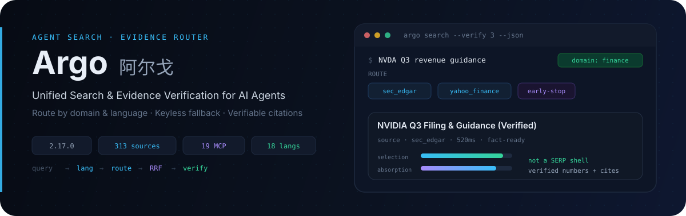

<p align="center">
  
</p>

<p align="center">
  <a href="README.md">English</a> ·
  <a href="README.zh.md">中文</a> ·
  <a href="README.ja.md">日本語</a> ·
  <a href="README.ko.md">한국어</a> ·
  <strong>Español</strong>
</p>

<p align="center">
  <a href="https://github.com/taxueseek/argo/stargazers"></a>
  <a href="https://www.npmjs.com/package/argo-search"></a>
  <a href="https://skills.sh/taxueseek/argo"></a>
  
  
  
  
  
</p>

> **Serie de skills taxueseek** (búsqueda e investigación profunda): [plainspoken-writing](https://github.com/taxueseek/plainspoken-writing) 77★ · [session-digger](https://github.com/taxueseek/session-digger) 34★ · [taxue-invest](https://github.com/taxueseek/taxue-invest) 30★ · [taxueskills](https://github.com/taxueseek/taxueskills) 25★ · [taxue-creative-style](https://github.com/taxueseek/taxue-creative-style) 19★ · [ime-lexicon](https://github.com/taxueseek/ime-lexicon) 16★ | **Plugins DSH**: [plugin-fast-adapt](https://github.com/taxueseek/plugin-fast-adapt) 48★ · [dsh-files](https://github.com/taxueseek/dsh-files) 44★ · [taxue-dsh-artisan](https://github.com/taxueseek/taxue-dsh-artisan) 3★ · [dsh-plugin-guard](https://github.com/taxueseek/dsh-plugin-guard) 2★

**Argo** es una herramienta de código abierto para búsqueda multi-motor, extracción web y verificación de evidencia diseñada para agentes de IA. Funciona **sin necesidad de claves API de pago** mediante respaldo local gratuito, enruta consultas en **18 idiomas** y verifica hechos directamente sobre el texto completo de las fuentes.

---

## Inicio Rápido

- **Claude Code (MCP)**:
  ```bash
  claude mcp add argo -- npx -y argo-search
  ```
- **Agent Skill (`skills.sh` — Claude Code / Cursor / Codex)**:
  ```bash
  npx skills add taxueseek/argo
  ```
- **Cursor / Windsurf (`mcpServers` JSON)**:
  ```json
  {
    "mcpServers": {
      "argo": { "command": "npx", "args": ["-y", "argo-search"] }
    }
  }
  ```
- **CLI Local**:
  ```bash
  curl -fsSL https://raw.githubusercontent.com/taxueseek/argo/main/scripts/install.sh | bash
  ```

---

## Por qué Argo

| Capacidad | Búsqueda Integrada | APIs Comerciales (Tavily / Exa) | Argo |
| :--- | :--- | :--- | :--- |
| **Costo y Claves** | Limitado al host | Pago por uso · clave obligatoria | **Respaldo gratuito sin clave** (claves opcionales mejoran calidad) |
| **Enrutamiento** | Índice genérico único | Índice web general | **Por dominio y 18 idiomas** (académico, código, finanzas) |
| **Verificación** | Solo fragmentos | Fragmentos o texto bruto | **`--verify` descarga la fuente y calcula puntuación de evidencia** |
| **Búsqueda Local** | No | No | **Archivos locales + notas semánticas (`local-seek`)** |

```bash
# Ejemplo: consulta en español con verificación de fuentes y salida compacta
argo search "arquitectura de agentes RAG 2026" --verify 2 --json --fields agent
```

---

## Capacidades y Documentación

- **Agregación de Búsqueda IA**: combina canales gratuitos sin clave (`tavily_free`, `parallel_free`, `anysearch`) con **DeepSeek Search**, **Tencent Yuanbao (Hunyuan)**, **Metaso**, **Bocha**, **Tavily** y **Exa** bajo un mismo enrutador.
- **19 herramientas MCP** (`argo_search`, `argo_fetch`, `argo_research`, `argo_evidence`, `argo_local_search`, etc.), 3 Skills independientes (`argo`, `argo-wide-research`, `local-seek`) y módulos internos (`local-search`, `ego-search`, `js-run`).
- **Plugin DSH** (`dsh plugin --profile web add argo-search`) con 18 herramientas nativas, 35 interruptores de comportamiento y orquestación paralela ([packages/dsh-plugin/README.md](packages/dsh-plugin/README.md)).
- Documentación completa: [docs/ENGINE_CATALOG.md](docs/ENGINE_CATALOG.md) · [docs/MCP_SETUP.md](docs/MCP_SETUP.md) · [docs/CHANGELOG.md](docs/CHANGELOG.md)

| Versión | Novedades |
| :--- | :--- |
| **v2.18.0** | Interruptor `--agent` y enrutamiento `--intent`, `fetch_dispatch` unificado, `local-seek` modular (`--symbol-body`) conectado a Workbench, y 4 PRs comunitarios de `@OMSociety` (respuesta exacta de Zhihu, búsqueda verificada en X con fallback, metadatos de imagen y fix de bloqueo DSH; 314 fuentes) |
| **v2.17.0** | Pushdown nativo de operadores de consulta, autenticación de 4 estados y control de ritmo en `ego-search`, anclaje determinista de evidencia, tendencias diarias en Workbench y barrera TCP loopback (313 fuentes) |
| **v2.16.0** | Argo Workbench UI en DSH, pipeline CLI de 4 etapas, `linux.do` + canal gratuito Keenable (312 fuentes), fallback sin clave en Jina, endurecimiento de concurrencia y caché |
| **v2.15.0** | Cadena completa de Zhihu, transmisión de autoridad en evidencia, fallback semántico sin clave, conector MCP genérico (`type: mcp`), evaluación de rutas desde cero, 311 fuentes |
| **v2.14.1** | Adelgazamiento de arquitectura, herramientas MCP 3+1 y alias compatibles, 304 fuentes, redacción `secret_guard.py` |
| **v2.14.0** | Consolidación del parser, 300 fuentes, ciclo de registro de fallos |
| **v2.13.0** | Consolidación documental, máquina de 22 estados SSOT, gracia de despacho |

<details>
<summary>Resumen de la versión v2.18.0</summary>

### Capacidades actuales (v2.18.0)

v2.18.0 unifica la entrada orientada a agentes, el despacho especializado de URL y las mejoras comunitarias de búsqueda social: añade `--agent` y enrutamiento `--intent` (`intent_router.py`), despacho unificado (`fetch_dispatch.py` para WeChat, X, arXiv y PDF), `local-seek` modular (`--outline` con rangos y `--symbol-body`) conectado directamente a Argo Workbench (`local-inspect` y `note-study`), selección incremental de pruebas L2 (`affected_tests.py`) y 4 PRs de `@OMSociety` (#52/#53/#54/#55: lectura exacta de respuestas de Zhihu con `--answer-offset`, búsqueda verificada en X con fallback FxTwitter (313→314), retención de metadatos de imagen en `--fields agent` e inicialización del directorio de bloqueo en DSH) conservando la autoría original.

### v2.18.0: Entrada Agent + `fetch_dispatch` Unificado + PRs Comunitarios (#52–#55)

Consulta [docs/RELEASE_NOTES_v2.18.0.md](docs/RELEASE_NOTES_v2.18.0.md) para más detalles.

### v2.17.0: Pushdown Nativo + Autenticación y Evidencia + Tendencias Diarias en Workbench

Consulta [docs/RELEASE_NOTES_v2.17.0.md](docs/RELEASE_NOTES_v2.17.0.md) para más detalles.

### v2.16.0: Argo Workbench UI + Pipeline CLI de 4 Etapas + Fuentes y Concurrencia

Consulta [docs/RELEASE_NOTES_v2.16.0.md](docs/RELEASE_NOTES_v2.16.0.md) para más detalles.

### v2.15.0: Cadena completa de Zhihu + Transmisión de autoridad en evidencia + Conector MCP

Consulta [docs/RELEASE_NOTES_v2.15.0.md](docs/RELEASE_NOTES_v2.15.0.md) para más detalles.

### v2.14.1: Adelgazamiento de Arquitectura + Herramientas MCP 3+1 + Redacción de Seguridad

Consulta [docs/RELEASE_NOTES_v2.14.1.md](docs/RELEASE_NOTES_v2.14.1.md) para más detalles.

</details>

---

> Una buena búsqueda no es ver más: es concluir con confianza, y saber cuándo aún no debes.

<p align="center">
  <picture>
    <source media="(prefers-color-scheme: dark)"
      srcset="https://api.star-history.com/svg?repos=taxueseek/argo&type=Date&theme=dark" />
    <source media="(prefers-color-scheme: light)"
      srcset="https://api.star-history.com/svg?repos=taxueseek/argo&type=Date" />
    
  </picture>
</p>

Si Argo te ha ayudado a llegar a una conclusión más sólida, [dale una Star](https://github.com/taxueseek/argo/stargazers) para que más gente lo descubra.
