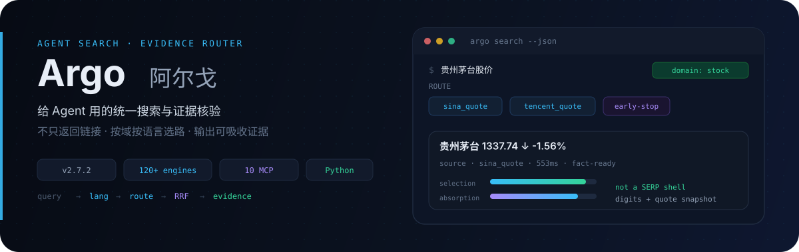
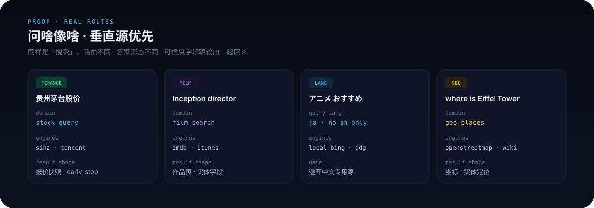
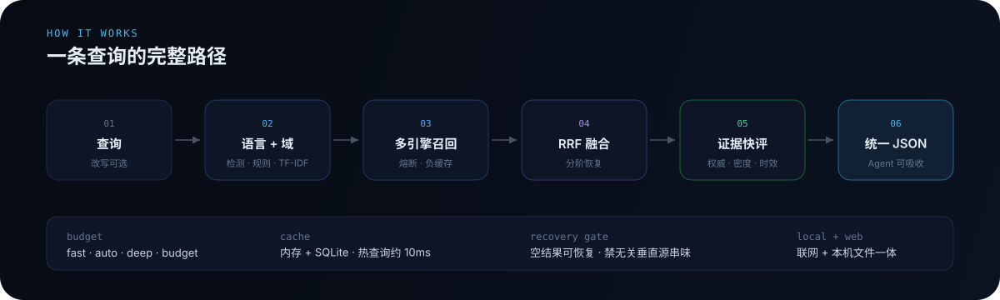

<p align="center">
  
</p>

<p align="center">
  <a href="README.md">中文</a> ·
  <a href="README.en.md">English</a> ·
  <strong>日本語</strong> ·
  <a href="README.ko.md">한국어</a> ·
  <a href="README.es.md">Español</a>
</p>

<p align="center">
  <a href="#これは何か">紹介</a> ·
  <a href="#聞き方に合わせたルーティング">証明</a> ·
  <a href="#仕組み">仕組み</a> ·
  <a href="#クイックスタート">導入</a> ·
  <a href="#できること">機能</a> ·
  <a href="#インストールと設定">設定</a> ·
  <a href="#更新履歴">更新</a>
</p>

<p align="center">
  
  
  
  
  
</p>

---

## これは何か

**Argo は AI エージェント向けの多言語検索インフラです。**

現実の検索は「1 言語 + 1 検索ボックス」ではありません。A 株の株価を聞く人もいれば、World Cup を聞く人も、日本語でアニメを探す人も、IMDb で監督を調べる人もいます。Argo の出発点はシンプルです——**領域・言語・意図に応じて経路を選び**、適切なソースへ問題を届け、常に一般的なウェブタイトルを浚うだけにはしない。ウェブ検索とローカルファイル検索を一体で使えます。

> 出力は「リンク一覧」ではなく **証拠候補 + 信頼度分解** です。経路が正しければ、証拠が立ちます。

### 「検索 API を一枚包んだだけ」との違い

| よくあるやり方 | Argo |
|----------------|------|
| 1 エンジン・1 Key に固定 | 多エンジン自動ルーティング、無料優先・予算制御 |
| 何でも汎用ウェブ検索 | **垂直ソース優先**：相場・映像・スポーツ・マクロ・化学など答え型の結果 |
| 中英だけ最適化 | **言語検出 + エンジン言語パラメータ + 言語横断フォールバック** |
| スニペット要約で終了 | 選択閾値 × 証拠密度 × 鮮度 × 多ソース合意 |
| 1 エンジン障害で全体停止 | サーキットブレーカ、負キャッシュ、段階的復旧（垂直汚染を防止） |
| 毎回ネットワーク | 二層キャッシュ（メモリ + SQLite）、ホットクエリ約 10ms |
| 日常も研究も同じ遅さ | **日常はエンジンを絞り、研究で広げる** |
| 長い JSON で文脈が膨張 | MCP 応答をコンパクト化、snippet 制御可 |

---

## 聞き方に合わせたルーティング

<p align="center">
  
</p>

| こう聞くと | だいたいこう動く |
|------------|------------------|
| 贵州茅台股价 | A 株相場ドメイン、スナップショット優先、足りれば early-stop |
| AAPL / 米株プレマーケット | 米株ドメイン、A 株と分離 |
| 肖申克的救赎 主演 / Inception director | 映像ドメイン → IMDb など |
| 梅西 俱乐部 / 库里 球队 | スポーツ → TheSportsDB など |
| 埃菲尔铁塔在哪 / where is Eiffel Tower | 地理エンティティ → OpenStreetMap など |
| NASA founding year / 国务院职能 | 組織 → Wikidata など |
| 周杰伦 专辑 / Taylor Swift album | メディア → iTunes など |
| アニメ おすすめ / 한국 영화 추천 | 日/韓を検出 → 言語に合うソース、中国語専用サイトを避ける |
| 米国 CPI、中国 GDP | マクロ；国別分流 |
| 阿司匹林 分子式 | 化学 → PubChem 系 |
| 台積電バリュエーション議論（深掘り） | サブ問題分割 + 並列ソース、垂直を boost |

---

## 仕組み

<p align="center">
  
</p>

```
クエリ
  ├─ 意図の曖昧さ解消（任意）
  ├─ クエリ書き換え（任意；ルーティングは元の意図を見る）
  ├─ 言語検出 + 言語嗜好
  ├─ ルート（ドメイン規則 + TF-IDF + 予算 + 言語補完 + ホットパスキャッシュ）
  ├─ 多エンジン召回（ブレーカ / 負キャッシュ / 並列）
  ├─ 空結果の段階復旧（緩和 → 同族/汎用 → 言語横断；汚染防止）
  ├─ RRF 融合 + 任意リランク
  ├─ 証拠の速評（権威 · 密度 · 鮮度 · 合意）
  └─ 統一 JSON（engine_outcomes / recovery 含む）
```

### 証拠スコア（簡易）

```
selection  ≈ ドメイン権威。SERP / リダイレクト殻は大きく減点
absorption ≈ 数字 / 定義 / 比較 / 開示などの証拠密度
freshness  ≈ 公開時刻（「2015 年以来」のような歴史比較年は無視）
総合       ≈ 0.40·selection + 0.35·absorption + 0.15·freshness + 0.10·エンジン分
```

結果には `selection`、`absorption`、`credibility_fast`、`evidence_flags` などが付き、エージェントが直接並べ替えできます。

### エージェント利用の規律（推奨）

1. **高影響の問い**（ポジション、安全、真偽）：search → 速評を見る → top を `fetch` → 結論  
2. **数字**：口径（定義・範囲）を明示し、矛盾は並列表示、無理に合成しない  
3. **SERP / リダイレクト**：本文ソースにしない  
4. **SNS**：世論・物語として扱い、事実の真値にしない  
5. **ファクトチェック**：ソース / 比較 / 主体など層化したクエリを足す

---

## クイックスタート

どれか 1 つで十分です。**npm 公式パッケージに依存しなくても**最新版を使えます（v2.5.1 以降インストールの真源は **GitHub**、現在推奨 **v2.6.0**）。

**ゼロ設定で動く**：API Key なしなら無料エンジン + ローカル `local_*`。Key があるソースは品質が上がりやすく、無いものは自動スキップ。

### 方法一：インストールスクリプト（本機長期利用向け）

```bash
curl -fsSL https://raw.githubusercontent.com/taxueseek/argo/main/scripts/install.sh | bash
```

ホームと Skill リンク指定：

```bash
curl -fsSL https://raw.githubusercontent.com/taxueseek/argo/main/scripts/install.sh \
  | bash -s -- --home "$HOME/.local/share/argo" --link "$HOME/.claude/skills/argo"
```

確認：

```bash
python3 ~/.local/share/argo/scripts/search.py "贵州茅台股价" --json
python3 ~/.local/share/argo/scripts/search.py --list-engines
```

### 方法二：GitHub から MCP（エージェントへ即接続）

**Node.js 18+** と **Python 3.10+** が必要。初回：

```bash
pip3 install pyyaml
```

```bash
npx -y github:taxueseek/argo
```

クライアント設定例（Claude Code / Cursor / Kimi など）：

```json
{
  "mcpServers": {
    "argo": {
      "command": "npx",
      "args": ["-y", "github:taxueseek/argo"]
    }
  }
}
```

より安定・Node 不要：方法一で入れた後、ローカル Python を指す：

```json
{
  "mcpServers": {
    "argo": {
      "command": "python3",
      "args": ["/path/to/argo/scripts/mcp_server.py"]
    }
  }
}
```

Python が特殊なパスのとき：`export ARGO_PYTHON=/path/to/python3`（npx 入口のみ参照）。

### 方法三：Release ソースパッケージ

[Releases](https://github.com/taxueseek/argo/releases) から **`argo-2.6.0.tar.gz`** を入手：

```bash
tar -xzf argo-2.6.0.tar.gz
cd argo-2.6.0
pip3 install pyyaml
python3 scripts/search.py "Python asyncio" --json
python3 scripts/mcp_server.py
```

### 方法四：git clone（開発 / ソース改変）

```bash
git clone https://github.com/taxueseek/argo.git
cd argo
pip3 install pyyaml
bash scripts/install.sh --link ~/.claude/skills/argo   # 任意
python3 scripts/search.py --list-engines
```

### 方法五：Skill ディレクトリへ（シンボリックリンク、単一真源）

```bash
python3 scripts/link_source.py --to ~/.claude/skills/argo
python3 scripts/link_source.py --to ~/.agents/skills/argo

cp installs.local.yaml.example installs.local.yaml
python3 scripts/link_source.py
python3 scripts/link_source.py --check
```

### 方法六：Python ライブラリとして

```python
import sys
sys.path.insert(0, "/path/to/argo/scripts")
from search import super_search

result = super_search("Python asyncio", n=5, mode="fast")
for item in result["results"]:
    print(item["title"], item.get("credibility_fast"), item["url"])
```

```bash
# bin/argo を PATH に入れた場合
argo search "Python asyncio"
argo research "2026 公募ファンド保有構造"
argo evidence "検証したい主張"
```

---

## 対応プラットフォーム

| プラットフォーム | 接続 | 説明 |
|------------------|------|------|
| **Claude Code** | MCP / Skill | `npx` または `mcp_server.py`；`link_source.py` 可 |
| **Kimi / Grok Build** | MCP Server | 同上 |
| **Cursor / Cline / Continue** | MCP | MCP 対応 IDE プラグイン |
| **CLI** | `search.py` / `bin/argo` | スクリプト、cron、手動調査 |
| **Python プロジェクト** | `from search import super_search` | ライブラリ呼び出し |

### インストール後チェック

```bash
python3 --version          # 3.10+ が必要
python3 -c "import yaml; print('PyYAML OK')"
python3 -m pytest tests/test_unit.py -q   # 任意
python3 scripts/search.py --list-engines
```

---

## できること

| 機能 | 説明 | 入口 |
|------|------|------|
| 統合検索 | ルート → 召回 → 融合 → 速評 | `search.py` / `argo_search` |
| ローカルファイル検索 | 本機のコード/ノート/記憶（非ネット） | `argo_local_search` |
| 深掘り調査 | サブ問題、多ソース、ギャップ提示 | `research.py` / `argo_research` |
| 信頼度評価 | 権威 / 密度 / 鮮度 / 交差検証 | `evidence.py` / `argo_evidence` |
| 意図の曖昧さ解消 | 多義語、ブランド衝突、戦略提案 | `clarify.py` / `argo_clarify` |
| ページ取得 | HTTP 優先、必要ならブラウザ | `argo_fetch`（`mode=extract` で構造化） |
| スクショ / PDF | 画面キャプチャ、PDF 構造抽出 | `argo_screenshot` / `argo_pdf` |
| サイトクロール | 一覧ページの一括取得 | `argo_crawl` |
| SNS / 世論 | 微博 / 小红书 / B 站 / Reddit / X など | `argo_social_search` |

### 予算モード

| モード | 向き | 振る舞い |
|--------|------|----------|
| `fast` | 簡単な問い、速度優先 | 無料エンジン優先、有料リランク省略 |
| `auto` | 日常デフォルト | コストと品質の折衷 |
| `deep` | 調査・総説 | 品質優先、エンジン増可 |
| `budget` | 枠が厳しい | クォータ制御、使い切ると劣化 |

### 現時点の能力概要（v2.6.0）

- **約 120+ ソース、60+ ドメイン**：一般ウェブ + 金融 / マクロ / 映像 / スポーツ / 地理 / 組織 / メディア / 化学 / 学術 / コード（真源：`config.yaml`）
- **10 の MCP ツール**：検索、研究、証拠、曖昧さ解消、取得、スクショ、PDF、SNS、ローカル、クロール
- **多言語検索**：中・英・日・韓・キリル・タイ・アラビア・ヘブライ・ギリシャ・デーヴァナーガリーなど。ルーティングとエンジンパラメータが言語に追従。非中国語クエリは知乎 / 搜狗微信 / A 株スナップショットなど中国語専用源を避ける
- **垂直復旧の門禁**：空結果復旧で pypi / npm / 速報などを映像・スポーツへ「混ぜない」
- **日常は速く、研究は厚く**：`engine_policy` で日常 combo を締め、deep / research で長尾を開放

---

## エンジンとルーティング

設定上およそ **120+** ソース、**60+** ドメイン（`config.yaml` と `--list-engines` が基準）。

### 直結・垂直（抜粋）

| エンジン | 用途 | コスト傾向 |
|----------|------|------------|
| anysearch / duckduckgo | 一般 / 技術 | 無料 |
| sina_quote / tencent_quote / eastmoney | A 株 / 資金 | 無料 |
| finviz / seeking_alpha | 米株・海外金融 | 設定次第 |
| imdb / itunes / thesportsdb | 映像 / 音楽 / スポーツ | 主に無料 |
| local_openstreetmap / wikidata / wikipedia | 地理 / 組織 / 百科 | 無料 |
| arxiv / semantic_scholar / openalex | 学術 | 主に無料 |
| pubchem / gbif / rfc_editor | 化学 / 種 / 標準 | 無料 |
| github / stackoverflow / pypi / npm | コードとパッケージ | 設定次第 |
| byted / bocha / metaso / octen | 中国語ウェブ / AI 検索 | API / 低コスト |
| zhihu / wechat_sogou | 中国語意見 / 公式アカウント | API / 無料 |
| tavily / felo / exa | 国際 / 意味検索 | 有料または枠 |
| twitter / reddit / xiaohongshu / bilibili / weibo | SNS UGC | 無料（一部ログイン） |

### ローカルゼロコスト層（`local_*`）

独立した SearXNG は不要。主経路はプロセス内 HTML / RSS / JSON 解析（`local_bing`、`local_sogou`、`local_google`、`local_arxiv` など）。**多言語クエリ**ではエンジンの言語パラメータ（例：Bing `setlang`）を動的に書き換え、RRF 融合に参加します。

---

## 使用例

### 金融

```bash
python3 scripts/search.py "贵州茅台股价" --explain
# 典型：stock_query → 相場スナップショット
```

### 学術

```bash
python3 scripts/search.py "transformer attention mechanism paper" --json
# domain は academic になりやすく、arxiv などを含む
```

### 研究と検証

```bash
python3 scripts/research.py "2026 公募ファンド第2四半期 保有構造" --depth deep --json

python3 scripts/search.py "同一クエリ" --json | \
  python3 scripts/evidence.py "同一クエリ" --stdin --json
```

### MCP ツール一覧（10）

| ツール | 用途 |
|--------|------|
| `argo_search` | 統合検索 |
| `argo_local_search` | ローカルファイル（非ネット） |
| `argo_research` | 深掘り研究（social-sentiment モード含む） |
| `argo_evidence` | 信頼度評価 |
| `argo_clarify` | 意図の曖昧さ解消 |
| `argo_fetch` | スマート取得（`mode=extract` で構造化） |
| `argo_crawl` | サイトクロール |
| `argo_screenshot` | 画面キャプチャ |
| `argo_pdf` | PDF 抽出 |
| `argo_social_search` | 多プラットフォーム SNS（`mode=sentiment`） |

---

## インストールと設定

### 環境要件

| 項目 | 要件 |
|------|------|
| Python | 3.10+（CLI と MCP コア） |
| 依存 | `pip install pyyaml`（唯一のハード依存） |
| Node.js | **`npx` 入口のみ** 18+ |
| SearXNG | 不要（内蔵ローカルエンジン） |

### API Key（すべて任意）

未設定なら該当エンジンをスキップし、無料がバックストップ。**環境変数を使い**、本物の Key をリポジトリや Issue に書かないでください。

```bash
# 推奨（品質向上）
export TAVILY_API_KEY="your_key"
export BOCHA_API_KEY="your_key"
export METASO_API_KEY="your_key"
export ZHIHU_ACCESS_SECRET="your_key"

# 任意
export BRAVE_API_KEY="your_key"
export FELO_API_KEY="your_key"
export GITHUB_TOKEN="your_key"
export WEB_SEARCH_API_KEY="your_key"
export ANYSEARCH_API_KEY="your_key"
export OCTEN_API_KEY="your_key"
```

`config.yaml` には `{ENV_NAME}` プレースホルダのみ。平文の秘密はコミットしません。

### キャッシュ

既定 SQLite は `config.yaml` の `cache.db_path`（通常 `~/.cache/unified-search/cache.db`）。

| 種別 | おおよその TTL |
|------|----------------|
| 金融 | 約 5 分 |
| ニュース / リアルタイム | 約 10–15 分 |
| 一般 | 約 1 時間 |
| 研究 / 常緑 | 約 2–24 時間 |
| 空結果 | ごく短い（失敗を固定しない） |

### FAQ

**API Key なしで使える？**  
使えます。ローカル無料エンジンと無料 API が多く、未設定時は自動で無料経路。

**インストールスクリプトと npx の違いは？**  
スクリプトは本機固定・設定変更・Skill 接続向き。npx は MCP を素早く載せる向き。コアは同じ Python。

**エンジン確認は？**  
`python3 scripts/search.py --list-engines`、または `--explain`。

**コードが複数コピーされる？**  
しません。`link_source.py` で単一真源 + シンボリックリンクを推奨。rsync 複製はしない。

---

## CLI よく使う引数

```
python3 scripts/search.py [options] クエリ

  --engine, -e       エンジン、既定 auto
  --max-results, -n  件数、既定 5
  --depth, -d        fast | balanced | deep
  --mode             fast | auto | deep | budget
  --no-cache         キャッシュを飛ばす
  --explain          ルーティング説明を表示
  --json             JSON 出力
  --timeout, -t      タイムアウト秒
  --list-engines     エンジン一覧
```

---

## 設計の取捨

1. **エージェントが吸収できることを先に、リンク数は後。**  
2. **無料とローカルを先に、有料は任意の上乗せ。**  
3. **失敗は観測可能に**：空結果 / タイムアウト / ブレーカを分け、黙って飲み込まない。  
4. **設定駆動でエンジン拡張**、`config.yaml` が単一真源。  
5. **単一真源インストール**：リンクし、rsync しない。  
6. **SNS を真理庫にしない**；拡張と世論向きで、単独の真値には不向き。

---

## 向いている用途

- Claude Code / Grok Build / Codex / Kimi など **エージェントの検索バックエンド**  
- **多言語・多領域**の日常 Q&A：中英日韓 + 金融 / 映像 / スポーツ / 学術 / コード  
- **再現可能・キャッシュ可能**なスクリプトとパイプライン  
- ファクトチェック、公開金融情報、エンティティの **多ソース対照**

単独で向きにくいもの：プラットフォーム内の高度なエンゲージメント順位付け、長期運用の最大召回アグリゲータ（外付け SearXNG 主経路は内蔵ローカルエンジンに置換済み）。

---

## ディレクトリ（簡易）

```
argo/
├── README.md                # 中国語（既定）
├── README.en.md             # English
├── README.ja.md             # 日本語
├── README.ko.md             # 한국어
├── README.es.md             # Español
├── SKILL.md
├── package.json             # npx 入口
├── bin/argo.js              # Node MCP 起動
├── bin/argo                 # Python CLI
├── config.yaml              # エンジンとドメイン（真源）
├── assets/readme/           # README ビジュアル
├── backends/
├── scripts/                 # search / research / mcp / install …
├── sub-skills/local-search/
├── tests/
└── docs/
```

---

## 更新履歴

| 版 | 内容 |
|----|------|
| **v2.6.0** | **多言語検索**（検出 / エンジンパラメータ / 言語横断フォールバック）；映像・スポーツ・地理・組織・メディア垂直；recovery 汚染防止；能力族と行列回帰；約 120+ 源。[リリースノート](docs/RELEASE_NOTES_v2.6.0.md) |
| **v2.5.1** | 金融/マクロ/化学の答え源を厚く；エンジン階層 + combo 予算；[v2.5.1](docs/RELEASE_NOTES_v2.5.1.md) |
| **v2.5.0** | インストールスクリプト + npx；書き換えとルーティング分離；ホットパスキャッシュ；MCP コンパクト |
| **v2.4.0** | 低分ルートのフォールバックと SNS 誤吸フィルタ；キャッシュ depth / ソフトヒット；ブレーカと負キャッシュ；`engine_outcomes` |
| **v2.2–v2.3** | 証拠二段階、中国語ソース表、content_signals、fetch スタック、エンジン拡充 |
| **v2.1** | SNS エンジン層（多プラットフォーム UGC） |
| **v1.x** | 名称を Argo に統一、多エンジンルーティングと二層キャッシュ |

---

## 貢献

Issue と Pull Request を歓迎します。ルーティングや証拠ロジックを変えるときはテストを足してください：

```bash
python3 -m pytest tests/test_unit.py tests/test_multilingual.py -q
python3 scripts/regression_p0p1.py --offline
python3 scripts/matrix_search_eval.py --offline
python3 scripts/ab_eval_p0p1.py   # 任意、オンライン含む
```

コミット前：本物の API Key、本機絶対パス、cookie などを含めないこと。本機 Skill パスは `installs.local.yaml`（gitignore 済み）。

## License

MIT License © 2026 [taxueseek](https://github.com/taxueseek)

<p align="center">
  <a href="https://github.com/oil-oil/beautify-github-readme"></a>
</p>

---

> 良い検索は、もっと多く見せることではない。自信を持って結論できること——そしてまだ結論してはいけないときを知ることだ。
