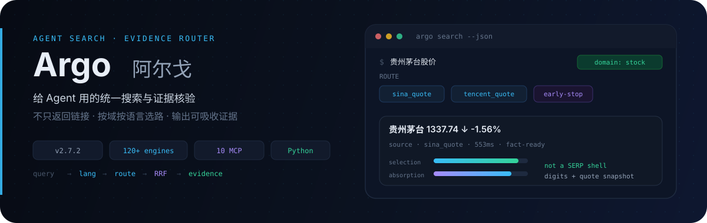
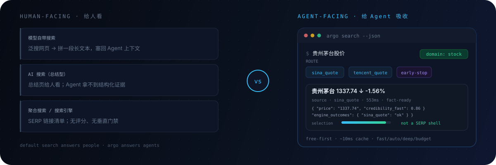
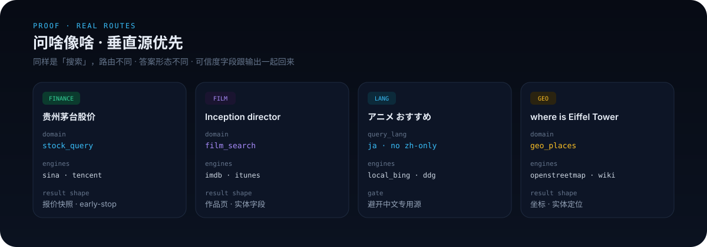
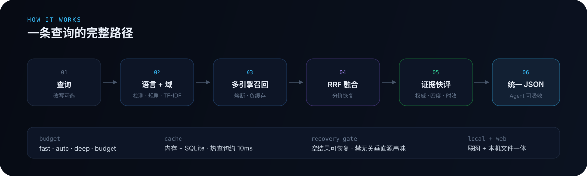

<p align="center">
  
</p>

<p align="center">
  <a href="README.md">中文</a> ·
  <a href="README.en.md">English</a> ·
  <a href="README.ja.md">日本語</a> ·
  <strong>한국어</strong> ·
  <a href="README.es.md">Español</a>
</p>

<p align="center">
  <a href="#무엇인가">소개</a> ·
  <a href="#모델-내장-검색--ai-검색--메타검색보다-강한-점">비교</a> ·
  <a href="#질문-형태에-맞는-라우팅">증명</a> ·
  <a href="#동작-방식">메커니즘</a> ·
  <a href="#빠른-시작">빠른 시작</a> ·
  <a href="#기능">기능</a> ·
  <a href="#설치와-설정">설정</a> ·
  <a href="#최근-업데이트">업데이트</a>
</p>

<p align="center">
  
  
  
  
  
</p>

> **이 저장소는 taxueseek의 DeepSeek Harness 플러그인 라인업 중 하나**입니다（[dsh-files](https://github.com/taxueseek/dsh-files) 39★）. 같은 저자 스킬 시리즈: [session-digger](https://github.com/taxueseek/session-digger) 29★ · [fund-investment-guide](https://github.com/taxueseek/fund-investment-guide) 21★ · [taxueskills](https://github.com/taxueseek/taxueskills) 23★ · [taxue-creative-style](https://github.com/taxueseek/taxue-creative-style) 12★

## 모델 내장 검색 / AI 검색 / 메타검색보다 강한 점

> 간단히: 앞의 세 가지는 **사람**이 정보를 찾게 돕습니다. Argo는 **에이전트**가 검색과 검증을 한 파이프라인에서 하게 합니다. 차이는 UI가 아니라 산출물 — 사람용 요약 페이지·링크 목록 대, 에이전트가 정렬하고 `fetch`로 재확인하고 컨텍스트를 안 터뜨리는 증거.

<p align="center">
  
</p>

| 차원 | 모델 내장 검색 | AI 검색(요약형) | 메타검색 / 검색 엔진 | **Argo** |
|------|----------------|-----------------|----------------------|----------|
| 결과 형태 | 이어 붙인 장문 | 사람용 요약 페이지 | SERP 링크 목록 | **압축 JSON: 증거 후보 + 신뢰도 분해** |
| 수직 질문(시세 / 화학식) | 일반 웹 | 일반 웹 후 요약 | 일반 웹 | **수직 소스 직결, 답형 결과** |
| 증거 신뢰도 | 점수 없음 | 구조화 점수 없음 | 점수 없음 | **selection · absorption · freshness · 합의** |
| 반복 질의 | 매번 네트워크 | 매번 네트워크 | 페이지 캐시 | **이중 캐시(메모리 + SQLite), 핫 쿼리 약 10ms** |
| 비용 제어 | 제어 불가 | 호출당 비쌈 | 무료지만 수고 | **예산 모드, 무료 우선, 키는 모두 선택** |
| 다국어 | 모델을 따름 | 모델을 따름 | 엔진을 따름 | **언어 감지 + 엔진 로케일 파라미터 + 다국어 라우팅** |

> 메커니즘상 Argo는 검색을 **증거 파이프라인**으로 다룹니다: 언어 감지 → 도메인 라우트 → 다중 엔진 회수 → RRF 융합 → 증거 속평. 에이전트가 정렬하고, `fetch`로 확인하고, 컨텍스트 안에 넣을 재료를 줍니다.

---

## 2026년 검색에서 바뀐 것

1. **링크에서 증거로.** 에이전트는 정렬·검증 가능하고 컨텍스트에 맞는 구조화 자료가 필요 — Argo는 신뢰도 분해 JSON을 반환.
2. **컨텍스트가 첫 번째 비용.** 에이전트 프로필은 회당 약 3.7KB, 필드와 바이트 예산은 게이트로 고정.
3. **사이트들이 AI용 콘텐츠를 준비.** llms.txt와 `.md` 직접 출력이 확산 — fetch 체인이 레벨 0에서 자동 탐지, r.jina.ai 리더가 fallback.
4. **무료 오픈 생태계로 충분.** 정부·학술·표준·보안 공개 API와 키리스 엔진이 대부분 도메인을 커버 (무설정 225개).
5. **품질은 측정 가능.** 랭킹 골든 플로어, 융합 이득 어블레이션 게이트, 음의 라우팅 제어.

> v2.8.9은 이 모두를 구현: 261 소스 / 93 도메인 / 226 무설정.

---

## 무엇인가

**Argo는 AI 에이전트를 위한 다국어 검색 인프라입니다.**

실제 검색은 결코 「한 언어 + 검색창 하나」가 아닙니다. A주 시세를 묻는 사람, World Cup을 묻는 사람, 일본어로 애니를 찾는 사람, IMDb에서 감독 정보를 원하는 사람이 있습니다. Argo의 출발점은 단순합니다—**도메인·언어·의도에 따라 길을 고르고**, 문제를 알맞은 소스로 보내지 웹 제목만 훑지 않습니다. 온라인 검색과 로컬 파일 검색을 함께 쓸 수 있습니다.

> 산출물은 「링크 목록」이 아니라 **증거 후보 + 신뢰도 분해**입니다. 길이 맞아야 증거가 설 수 있습니다.

### 「검색 API를 한 겹 더 감싼 것」과의 차이

| 흔한 방식 | Argo |
|---------|------|
| 엔진 하나·키 하나에 고정 | 다중 엔진 자동 라우팅, 무료 우선·예산 설정 가능 |
| 모든 질문을 일반 웹 검색 | **수직 소스 우선**: 시세·영화·스포츠·매크로·화학 등 답형 결과 |
| 중·영에만 최적화 | **언어 감지 + 엔진 언어 파라미터 + 교차 언어 폴백** |
| 검색 후 스니펫 요약만 | 선택 문턱 × 증거 밀도 × 시의성 × 다중 소스 합의 |
| 엔진 하나가 죽으면 전체 중단 | 서킷 브레이커, 네거티브 캐시, 단계적 복구(수직 소스 오염 방지) |
| 매번 네트워크 재호출 | 이중 캐시(메모리 + SQLite), 핫 쿼리 약 10ms급 |
| 일상·연구에 같은 느린 경로 | **일상은 엔진 적게, 심층 연구는 넓게** |
| 긴 JSON이 에이전트 컨텍스트 소모 | MCP 응답 압축, 스니펫 제어 가능 |

---

## 질문 형태에 맞는 라우팅

<p align="center">
  
</p>

| 이렇게 물으면 | 대개 일어나는 일 |
|---------|----------------------|
| python asyncio error handling | 코딩 QA 도메인 → StackOverflow/StackExchange 공식 API, 점수·채택 마커 포함 |
| AAPL / US pre-market | 미국 주식 도메인, A주와 분리 |
| 肖申克的救赎 主演 / Inception director | 영화 도메인 → IMDb 등 |
| 梅西 俱乐部 / 库里 球队 | 스포츠 도메인 → TheSportsDB 등 |
| 埃菲尔铁塔在哪 / where is Eiffel Tower | 지리 엔티티 → OpenStreetMap 등 |
| NASA founding year / 国务院职能 | 조직 엔티티 → Wikidata 등 |
| 周杰伦 专辑 / Taylor Swift album | 미디어 도메인 → iTunes 등 |
| アニメ おすすめ / 한국 영화 추천 | JA/KO 감지 → 언어 친화 소스, 중국어 전용 사이트 회피 |
| US CPI, 일본 인플레이션 | 매크로 도메인, 국가 분리 (자국 1차 소스 우선) |
| log4j CVSS / nodejs 22 end of life | 보안 → NVD 공식; 수명주기 → endoflife.date |
| attention is all you need | 학술 → arXiv/OpenAlex/CrossRef 메타데이터 및 DOI 링크 |
| 阿司匹林 分子式 | 화학 → PubChem 계열 답 |
| TSMC valuation debate (deep research) | 하위 질문 + 병렬 소스, 수직 소스 가중 |

---

## 동작 방식

<p align="center">
  
</p>

```
query
  ├─ intent clarify (optional)
  ├─ query rewrite (optional; routing still sees original intent)
  ├─ language detect + language preference
  ├─ route (domain rules + TF-IDF + budget + lang supplements + hot-path cache)
  ├─ multi-engine recall (circuit breaker / negative cache / parallel)
  ├─ staged empty-result recovery (widen → same family/general → cross-lang; anti-pollution)
  ├─ RRF fusion + optional re-rank
  ├─ evidence skim (authority · density · freshness · consensus)
  └─ unified JSON (incl. engine_outcomes / recovery)
```

### 증거 점수 (요약)

```
selection  ≈ domain authority; SERP / redirect shells ranked very low
absorption ≈ density of numbers / definitions / comparisons / disclosures
freshness  ≈ publish time (ignores historical comparison years like “since 2015”)
composite  ≈ 0.40·selection + 0.35·absorption + 0.15·freshness + 0.10·engine score
```

결과에 `selection`, `absorption`, `credibility_fast`, `evidence_flags` 등이 포함되어 에이전트가 바로 정렬할 수 있습니다.

### 에이전트 규율 (권장)

1. **고위험 질문**(포지션, 안전, 「이게 사실인가?」): 검색 → 빠른 점수 확인 → 상위 결과 `fetch` → 그다음 결론  
2. **숫자**: 计算方式(정의·범위)을 밝히고, 소스가 충돌하면 나열—억지로 합치지 않기  
3. **SERP / 리다이렉트 페이지**: 1차 출처로 취급하지 않기  
4. **소셜 포스트**: 감성과 서사, 최종 사실 근거가 아님  
5. **팩트체크**: 층위별 소수 쿼리 선호(출처 / 비교 / 대상)

---

## 빠른 시작

경로를 고르면 됩니다. **설치 진원은 GitHub뿐입니다**(`npx github:taxueseek/argo` 또는 `install.sh`); 현재 권장 **v2.8.9**. **`npm install argo-search`는 쓰지 마세요** — npm 레지스트리 사본은 **비공식 낡은 v1.0.1**(이 저장소가 아님, 기능 부족, 갱신 안 됨). 이 패키지는 `private: true`로 npm 오배포를 막습니다.

**제로 설정으로 동작**: API 키 없이도 무료 엔진 + 로컬 `local_*` 엔진이 돌고, 키 없는 엔진은 스킵됩니다(키가 있으면 보통 더 좋습니다).

### 옵션 1: 설치 스크립트 (장기 로컬 사용에 적합)

```bash
curl -fsSL https://raw.githubusercontent.com/taxueseek/argo/main/scripts/install.sh | bash
```

홈 경로 + Skill 링크 지정:

```bash
curl -fsSL https://raw.githubusercontent.com/taxueseek/argo/main/scripts/install.sh \
  | bash -s -- --home "$HOME/.local/share/argo" --link "$HOME/.claude/skills/argo"
```

확인:

```bash
python3 ~/.local/share/argo/scripts/search.py "python asyncio error handling" --json
python3 ~/.local/share/argo/scripts/search.py --list-engines
```

### 옵션 2: GitHub MCP (에이전트에 빠르게 붙이기)

**Node.js 18+** 와 **Python 3.9+** 필요. 한 번:

```bash
pip3 install pyyaml
```

```bash
npx -y github:taxueseek/argo
```

클라이언트 설정 (Claude Code / Cursor / Kimi 등):

```json
{
  "mcpServers": {
    "argo": {
      "command": "npx",
      "args": ["-y", "github:taxueseek/argo"]
    }
  }
}
```

더 안정적·Node 불필요: 옵션 1로 설치 후 로컬 Python 지정:

```json
{
  "mcpServers": {
    "argo": {
      "command": "python3",
      "args": ["/path/to/argo/scripts/mcp_server.py"]
    }
  }
}
```

비표준 Python 경로: `export ARGO_PYTHON=/path/to/python3` (npx 진입점만 읽음).

### DeepSeek Harness 한 줄 플러그인

DeepSeek Harness에는 두 가지 설치:

```bash
# A: mcp__argo__* 도구 19개 (메인 패키지 bundle, MCP 전량과 동일)
dsh plugin --profile web add "github:taxueseek/argo"

# B: 검색 도구 + wide_research 병렬 연구 오케스트레이션 (서브패키지)
dsh plugin --profile web add "github:taxueseek/argo#main&path:packages/dsh-plugin"
```

설치 후 `dsh web`을 재시작. 자세한 내용은 `packages/dsh-plugin/`.

### 옵션 3: 릴리스 tarball

[Releases](https://github.com/taxueseek/argo/releases)에서 최신 **`argo-x.y.z.tar.gz`** 다운로드(`x.y.z`는 최신 릴리스 번호로 바꿔 읽기):

```bash
tar -xzf argo-x.y.z.tar.gz
cd argo-x.y.z
pip3 install pyyaml
python3 scripts/search.py "Python asyncio" --json
python3 scripts/mcp_server.py
```

### 옵션 4: git clone (개발 / 소스 패치)

```bash
git clone https://github.com/taxueseek/argo.git
cd argo
pip3 install pyyaml
bash scripts/install.sh --link ~/.claude/skills/argo   # optional
python3 scripts/search.py --list-engines
```

### 옵션 5: Skill 디렉터리 (심볼릭 링크, 단일 진원)

```bash
python3 scripts/link_source.py --to ~/.claude/skills/argo
python3 scripts/link_source.py --to ~/.agents/skills/argo

cp installs.local.yaml.example installs.local.yaml
python3 scripts/link_source.py
python3 scripts/link_source.py --check
```

### 옵션 6: Python 라이브러리

```python
import sys
sys.path.insert(0, "/path/to/argo/scripts")
from search import super_search

result = super_search("Python asyncio", n=5, mode="fast")
for item in result["results"]:
    print(item["title"], item.get("credibility_fast"), item["url"])
```

```bash
# if bin/argo is on PATH
argo search "Python asyncio"
argo research "2026 mutual fund holdings structure"
argo evidence "a claim to verify"
```

---

## 플랫폼

| 플랫폼 | 연동 | 비고 |
|----------|-------------|-------|
| **Claude Code** | MCP / Skill 링크 | `npx` 또는 `mcp_server.py`; `link_source.py` 가능 |
| **Kimi / Grok Build** | MCP Server | 동일 |
| **Cursor / Cline / Continue** | MCP | MCP 지원 IDE 플러그인 |
| **CLI** | `search.py` / `bin/argo` | 스크립트, cron, 수동 디버그 |
| **Python 프로젝트** | `from search import super_search` | 라이브러리 호출 |

### 설치 후 점검

```bash
python3 --version          # 3.9+
python3 -c "import yaml; print('PyYAML OK')"
python3 -m pytest tests/test_unit.py -q   # optional
python3 scripts/search.py --list-engines
```

---

## 기능

| 기능 | 하는 일 | 진입점 |
|------------|--------------|-------|
| 통합 검색 | route → recall → fuse → skim score | `search.py` / `argo_search` |
| 로컬 파일 검색 | 디스크 코드/노트/메모리 (오프라인) | `argo_local_search` |
| 로컬 텍스트 미리보기 | 화이트리스트 디렉터리 미리보기 (fail-closed) | `argo_local_read` |
| 재계산 | 제한 서브프로세스 수치 재계산 (기본 거부) | `argo_recompute` |
| 심층 연구 | 하위 질문, 다중 소스, 갭 힌트 | `research.py` / `argo_research` |
| 신뢰도 | 권위 / 밀도 / 시의성 / 교차 검증 | `evidence.py` / `argo_evidence` |
| 의도 명확화 | 다의어, 브랜드 충돌, 전략 힌트 | `clarify.py` / `argo_clarify` |
| 페이지 가져오기 | HTTP 우선, 필요 시 브라우저 폴백 | `argo_fetch` (`mode=extract` 구조 추출) |
| 스크린샷 / PDF | 페이지 캡처, 구조화 PDF 추출 | `argo_screenshot` / `argo_pdf` |
| 사이트 크롤 | 목록 페이지 배치 크롤 | `argo_crawl` |
| 소셜 / 감성 | Weibo / Xiaohongshu / Bilibili / Reddit / X … | `argo_social_search` |

### 예산 모드

| 모드 | 적합한 경우 | 동작 |
|------|----------|----------|
| `fast` | 단순 Q, 속도 필요 | 무료 엔진 우선, 유료 re-rank 스킵 |
| `auto` | 일상 기본 | 비용 인식 품질/지출 트레이드오프 |
| `deep` | 연구, 조사 | 품질 우선, 엔진 더 허용 |
| `budget` | 할당량 타이트 | 쿼터 제어, 소진 시 저하 |

### 대략적인 능력 세트 (v2.8.9)

- **로컬 데이터 융합 (v2.8.4 신규)**: 연구 작업 패키지에 `file_inputs`(로컬 1차 데이터, sha256/혈통 등기) + `recompute`(샌드박스 재계산); dossier가 `local_sources` 출력
- **MCP 한 줄 주입 (v2.8.4 신규)**: `argo mcp inject`로 Claude Code / Cursor / Windsurf / Codex / OpenCode / Cline (원자 쓰기 + 백업 + 가역; 진원 `mcp/clients.yaml`)
- **구조화 검색 강화 (v2.8.4 신규)**: 쿼리 정규화 + 변체 + 복잡도 게이트; 소셜 문법 우선; TF-IDF는 중국어 엔진을 버린 뒤에도 후보를 봄; `--include-local`
- **Keenable (v2.8.4 신규)**: 일반 웹 검색 엔진 추가 (L1 선언적 HTTP, 무료 체험, `ARGO_KEENABLE_API_KEY`)
- **261 소스, 93 도메인** (226 무설정): 일반 웹 + 금융 / 매크로 / 영화 / 스포츠 / 지리 / 조직 / 미디어 / 화학 / 학술 / 코드 (진원: `config.yaml`)
- **MCP 도구 19개**(CLI 기능 면과 동일): search, research, evidence, clarify, fetch, screenshot, PDF, social, local files, crawl, local preview, recompute, 위챗 공식전 원문, 채용 집계, 구조화 추출, URL 일괄 사전점검, 직답, 웹 변화 관찰, DOI 인용 항목
- **다국어 검색**: 중국어, 영어, 일본어, 한국어, 키릴, 태국어, 아랍어, 히브리어, 그리스어, 데바나가리, …; 라우팅과 엔진 파라미터가 언어를 따름; 비중국어 쿼리는 중국어 전용 소스 회피 (Zhihu / Sogou WeChat / A주 스냅샷 등)
- **수직 복구 게이트**: 빈 결과 복구 시 영화·스포츠에 pypi / npm / 속보 등이 「새지」 않음
- **일상은 빠르게, 연구는 넓게**: `engine_policy` 티어—일상 콤보는 타이트, deep / research는 롱테일 개방

---

## 엔진과 라우팅

설정에는 현재 약 **253** 소스와 **93** 도메인이 있습니다 (`config.yaml`, `--list-engines` 참고).

### 직접·수직 (발췌)

| 엔진 | 시나리오 | 비용 성향 |
|--------|----------|-----------|
| anysearch / duckduckgo | 일반 / 기술 | free |
| sina_quote / tencent_quote / eastmoney | A주 시세 / 자금 흐름 | free |
| finviz / seeking_alpha | 미국·해외 금융 | depends |
| imdb / itunes / thesportsdb | 영화 / 음악 / 스포츠 | mostly free |
| local_openstreetmap / wikidata / wikipedia | 지리 / 조직 / 백과 | free |
| arxiv / semantic_scholar / openalex | 학술 | mostly free |
| pubchem / gbif / rfc_editor | 화학 / 종 / 표준 | free |
| github / stackoverflow / pypi / npm | 코드·패키지 | depends |
| byted / bocha / metaso / octen | 중국 웹 / AI 검색 | API / low cost |
| zhihu / wechat_sogou | 중국 여론 / WeChat | API / free |
| tavily / felo / exa | 국제 / 시맨틱 | paid or quota |
| twitter / reddit / xiaohongshu / bilibili / weibo | 소셜 UGC | free (some need login) |

### 로컬 제로 비용 레이어 (`local_*`)

별도 SearXNG 서비스 불필요. 메인 경로는 프로세스 내 HTML / RSS / JSON 파싱 (`local_bing`, `local_sogou`, `local_google`, `local_arxiv`, …). **다국어 쿼리**에서는 라우팅이 엔진 언어 파라미터를 재작성(예: Bing `setlang`)하고 RRF로 융합합니다.

---

## 예시

### 금융

```bash
python3 scripts/search.py "python asyncio error handling" --explain
# typical: stock_query → quote snapshot sources
```

### 학술

```bash
python3 scripts/search.py "transformer attention mechanism paper" --json
# domain often academic; combo includes arxiv etc.
```

### 연구와 검증

```bash
python3 scripts/research.py "2026 mutual fund Q2 holdings structure" --depth deep --json

python3 scripts/search.py "same query" --json | \
  python3 scripts/evidence.py "same query" --stdin --json
```

### MCP 도구 (12)

| 도구 | 용도 |
|------|---------|
| `argo_search` | 통합 검색 |
| `argo_local_search` | 로컬 파일 (오프라인) |
| `argo_local_read` | 화이트리스트 로컬 텍스트 미리보기 (fail-closed) |
| `argo_recompute` | 제한 서브프로세스 재계산 (기본 거부, 인가 필요) |
| `argo_research` | 심층 연구 (소셜 감성 모드 포함) |
| `argo_evidence` | 신뢰도 점수 |
| `argo_clarify` | 의도 명확화 |
| `argo_fetch` | 스마트 fetch (`mode=extract` 구조 추출) |
| `argo_crawl` | 사이트 크롤 |
| `argo_screenshot` | 페이지 스크린샷 |
| `argo_pdf` | PDF 추출 |
| `argo_social_search` | 멀티 플랫폼 소셜 (`mode=sentiment`) |

---

## 설치와 설정

### 요구 사항

| 항목 | 요구 |
|------|-------------|
| Python | 3.9+ (CLI + MCP 코어) |
| 의존성 | `pip install pyyaml` (필수 의존성 하나) |
| Node.js | **`npx` 진입에만** 필요, 18+ |
| SearXNG | 불필요 (내장 로컬 엔진) |

### API 키 (모두 선택)

키가 없으면 해당 엔진 스킵, 무료 엔진이 버팀. **환경 변수 사용**—실제 키를 커밋하거나 이슈에 붙이지 마세요.

```bash
# recommended (better quality)
export TAVILY_API_KEY="your_key"
export BOCHA_API_KEY="your_key"
export METASO_API_KEY="your_key"
export ZHIHU_ACCESS_SECRET="your_key"

# optional
export BRAVE_API_KEY="your_key"
export FELO_API_KEY="your_key"
export GITHUB_TOKEN="your_key"
export WEB_SEARCH_API_KEY="your_key"
export ANYSEARCH_API_KEY="your_key"
export OCTEN_API_KEY="your_key"
export ARGO_KEENABLE_API_KEY="your_key"   # 선택; Keenable 무료 체험
```

`config.yaml`에는 `{ENV_NAME}` 플레이스홀더만—git에 평문 시크릿 없음.

### 캐시

기본 SQLite 경로는 `config.yaml`의 `cache.db_path` (보통 `~/.cache/unified-search/cache.db`).

| 유형 | 대략 TTL |
|------|-------------|
| Finance | ~5 min |
| News / realtime | ~10–15 min |
| General | ~1 hour |
| Research / evergreen | ~2–24 hours |
| Empty results | very short (avoid freezing “no hits”) |

### FAQ

**API 키 없이도 되나요?**  
네. 많은 로컬 무료 엔진과 무료 API; 키 없는 경로가 자동입니다.

**설치 스크립트 vs npx?**  
스크립트: 고정 로컬 설치, 설정, Skill 링크. npx: MCP를 빠르게 붙임. 같은 Python 코어.

**엔진 확인은?**  
`python3 scripts/search.py --list-engines`, 또는 `--explain` 추가.

**저장소에 코드 사본이 여러 개?**  
아니요. `link_source.py`로 단일 소스 + 심볼릭 링크를 권장, rsync 복제 지양.

---

## CLI 플래그

```
python3 scripts/search.py [options] query

  --engine, -e       engine, default auto
  --max-results, -n  count, default 5
  --depth, -d        fast | balanced | deep
  --mode             fast | auto | deep | budget
  --no-cache         skip cache
  --explain          print routing explanation
  --json             JSON output
  --timeout, -t      timeout seconds
  --list-engines     list engines
```

---

## 설계 트레이드오프

1. **에이전트 흡수 우선, 링크 개수 차선.**  
2. **무료·로컬 우선, 유료는 선택적 향상.**  
3. **실패는 관측 가능**: empty / timeout / breaker에 라벨—조용히 삼키지 않음.  
4. **설정 주도 엔진**; `config.yaml`이 단일 진원.  
5. **단일 소스 설치**: 링크 엔트리, rsync 복제 금지.  
6. **소셜은 진리 라이브러리가 아님**; 확장·감성에는 좋으나 유일한 사실 근거는 아님.

---

## 잘 맞는 경우

- Claude Code / Grok Build / Codex / Kimi 에이전트의 검색 백엔드  
- **다국어·다도메인** Q&A: CJK + EN + 금융 / 영화 / 스포츠 / 학술 / 코드  
- **재현 가능·캐시 가능** 검색이 필요한 스크립트와 파이프라인  
- 공개 금융 / 엔티티 데이터의 팩트체크와 다중 소스 비교  

단독 솔루션으로 덜 적합한 경우: 플랫폼 네이티브 인게이지먼트 랭킹, 또는 장기 max-recall 애그리게이터(내장 로컬 엔진이 외부 SearXNG 메인 경로를 대체).

---

## 트리 (요약)

```
argo/
├── README.md                # Chinese (default)
├── README.en.md             # English
├── README.ja.md             # Japanese
├── README.ko.md             # Korean
├── README.es.md             # Spanish
├── SKILL.md
├── package.json             # npx entry
├── bin/argo.js              # Node MCP launcher
├── bin/argo                 # Python CLI
├── config.yaml              # engines & domains (source of truth)
├── assets/readme/           # README visuals
├── backends/
├── mcp/                     # 다중 클라이언트 MCP 주입 진원 (clients.yaml)
├── scripts/                 # search / research / mcp / install …
├── sub-skills/local-search/
├── sub-skills/ego-search/      # 로그인 상태 전문 검색 (기본 꺼짐)
├── tests/
└── docs/
```

---

## 최근 업데이트

### v2.9.2: DSH 0.2.1-alpha.1 호환 검증 + 라우팅/가드 수정 + js-run 서브 스킬

- **호환성**: DSH 플러그인을 최신 DSH 0.2.1-alpha.1에서 실측 검증 — 네이티브 퍼스트클래스 도구 / web_search seam / wide_research 삼형태 모두 정상 작동; `argo mcp inject`에 WorkBuddy를 추가해 7번째 호스트까지 지원
- **정확성**: TF-IDF 약증거 보조 소스 강등, 죽은 소스 플로어 + 서킷 브레이커 슬롯 재충전, 쿼터 소진 엔진 격리, serp_guard 오탐 수정
- **속도와 안정성**: engines/evidence 지연 임포트(import량 −50%), 어드미션 존재 집합 단락(open 261 → 99), MCP 진입/수치 인자 가드; 신규 서브 스킬 `sub-skills/js-run`(브라우저 없이 웹 JS 실행, P50 ≈ 1ms)

### v2.8.9: 출력 경량화 + 더 빠르고 풍부한 검색 + 해외 미디어 및 팩트체크 소스 5개

- **경량화**: 기본 출력 −66%(같은 결과를 세 번 쓰지 않음); 반복 쿼리 −30%(라우팅 결정 캐시); 느린 네트워크 대기 −36%(주 소스가 0.8초를 넘기면 자동으로 백업 소스 추가 기동)
- **충실화**: 리콜 +35%, 수집 지연 −30%; 본문 구조 보존 0/6 → 6/6(제목·목록·표가 눌리지 않음); 중국어 콘텐츠가 체계적으로 저품질 판정받지 않음
- **추가**: 소스 232 → 237(키 불필요 194 → 198, 전부 무료 — The Guardian, France 24, DW, 팩트체크 FactCheck.org / Full Fact 미·영 양권); 죽은 소스 gdelt 폐지
- **신뢰성**: 숫자가 서로 모순되던 여섯 장부 결함 수정; 6단 퍼널로 0건이 어느 층에서 무너졌는지 특정 가능; 오프라인 재생 도구로 변경 효과를 당일 검증. 자세히는 [릴리스 노트](docs/RELEASE_NOTES_v2.8.9.md)

### v2.8.8: 실사용자 버그 수정 + 전면 속도 개선 + 소스 232개

- **수정**: 문서 추천 이름으로 키를 설정해도 엔진이 조용히 0건을 반환하던 문제(#12), 수집 체인이 프록시를 무시해 GitHub 같은 사이트가 항상 실패하던 문제(#13) — 이제 `ARGO_PROXY`, config 도메인별 규칙, 표준 프록시 환경변수가 모두 작동하고 `NO_PROXY` 존중
- **속도**: 명령어 콜드 스타트 2.1s → 0.55s; 프로세스 간 설정 캐시 50–82ms → 16–18ms; 매 검색에 단계별 소요 시간과 예산 소비를 출력해 어디가 느린지 추측 불필요(`--no-timing`으로 비활성화)
- **신규**: 소스 218 → 232(설정 없이 바로 쓰는 184 → 194, 모두 키 불필요: 중국 트렌드 보드, 보안 취약점, 오픈 액세스 학술, 스킬 디렉터리, 에이전트 검색), 직답 `argo answer`, 웹 관찰 `argo watch`, CLI/MCP 도구면 정렬
- **안정성**: 3개 OS의 관례 경로(`argo paths` 자기점검 신규), Python 3.9 지원, 조용히 진행되던 성능 저하를 정직하게 기록. 자세한 내용은 [릴리스 노트](docs/RELEASE_NOTES_v2.8.8.md)

### v2.8.7: 소스 218개로 확충 + 수정 일괄

- **소스 확충**: 168 → 218 소스, 72 → 89 도메인 (StackExchange Q&A, DOI 메타데이터, 취약점 인텔, 제품 수명주기 등 공식 소스 추가), 본문 획득 직통 채널 3개 추가
- **수정 일괄**: 멀티 엔진 라우팅, 빈 결과 폴백, 중국어 리다이렉트, 로컬 검색 열화 등; 자세한 내용은 [릴리스 노트](docs/RELEASE_NOTES_v2.8.7.md)

### v2.8.6: 검색 고속화 + 멀티 소스 분담

- 엔진 레이싱, 지후 세 소스 분담, 언어/학술 디스패치 확대, 죽은 소스 게이트

### v2.8.5: DSH 플러그인 도구 네이티브화 + MCP 기본 끔 + Windows 호환

- **플러그인 도구 네이티브화**: `argo_search` / `argo_fetch`가 1급 네이티브 도구로 등록되어 MCP 연결 없이 기본 사용 가능; 스키마는 단일 진원 `mcp_tools.py`에서 자동 생성되어 양쪽 모두 드리프트 없음; `argo_research`를 제외한 18개 도구를 `nativeTools`로 수시 활성화 가능
- **MCP 기본 끔**: 3가지 접속 형태(수요 시 마운트 MCP / 기본 진입 네이티브 도구 / web_search seam); 평소 상주 토큰 비용 0, 19개 도구 전체가 필요하면 profile patch 한 장으로 엶
- **Windows 호환**(커뮤니티 PR #11): 임시 경로는 시스템 temp, GBK 인코딩 수정, `python3`/`python` 런타임 해석, symlink는 권한 없으면 junction으로 폴백, PowerShell 일괄 설치 `install.ps1` 추가
- **쿼터 자가 치유**: HTTP 200에 숨은 원격 쿼터 고갈을 감지하고, 라우팅이 해당 엔진을 제외해 백업 소스로 전환, 다음 쿼터 주기에 자동 복귀
- **페치 전역 deadline**: `ARGO_FETCH_DEADLINE_S`(기본 60s)로 폴백 사슬 총 시간 상한; 429/503 정지 시그널 존중; tinyfish 렌더링 + `.md` 변형 프로브

### v2.8.4: 로컬 데이터 융합 + 원 커맨드 MCP 연결

- **심층 연구가 로컬 데이터를 먹을 수 있음**: 작업 패키지에 `file_inputs`(1차 CSV / XLSX / 문헌; 해시는 등기, 내용은 넣지 않음) + `recompute`(샌드박스 재계산; 불일치는 플래그)
- **MCP 연결을 더 이상 손으로 안 고침**: `argo mcp inject`가 Claude Code / Cursor / Windsurf / Codex / OpenCode / Cline에 기록(원자 쓰기 + 백업 + 되돌리기)
- **간단한 쿼리는 싸게 유지**: 정규화 + 복잡도 게이트 + 소셜/플랫폼 문법 우선 + 중국어 엔진을 버려도 후보를 계속 봄
- **Keenable**을 무료 체험 웹 검색 소스로 추가
- **보안**: recompute가 외부 프로세스 출망을 차단; 호스트 경로는 설치 인지

> 자세한 내용은 아래 표와 각 버전 [릴리스 노트](docs/)。

---

## 변경 이력

| 버전 | 비고 |
|---------|-------|
| **v2.8.9** | **출력 경량화 + 더 빠르고 풍부한 검색 + 해외 미디어 및 팩트체크 소스 5개**: 기본 출력 15.5KB→5.2KB(−66%, `--envelope`로 전체 봉투 복원); 라우팅 결정 캐시로 반복 쿼리 −30%; 느린 네트워크 디스패치 −36%(직렬 도메인은 0.8초 초과 시 자동 헤지); 수집 체인 5차 개선(리콜 +35%, 지연 −30%, 롱테일 P90 −8%) + 본문 구조 복원(제목/목록/표 보존 0/6→6/6) + CJK 품질 점수 수정; 키 불필요 신규 소스 Guardian RSS / France 24 / DW / FactCheck.org / Full Fact(232→237, 키 불필요 194→198, 도메인 90→92), 죽은 gdelt 폐지; 자기일관성 결함 6곳 수정 + 6단 퍼널 귀속 + 오프라인 재생 도구(`scripts/replay_eval.py`) + 정책 후 배포 게이트 및 시나리오 임계값 계약. 자세히는 [릴리스 노트](docs/RELEASE_NOTES_v2.8.9.md) |
| **v2.8.8** | **실사용자 신고 수정(#12 키 별칭 무음 실패, #13 프록시 미지원 수집) + 전면 속도 개선 + 소스 218 → 232**: 출구 디스패치 통일(`ARGO_PROXY` / 도메인별 규칙 / 표준 프록시 변수, `NO_PROXY` 존중); 키 읽기 16곳을 별칭 체인으로 통일; 명령어 콜드 스타트 2.1s→0.55s, 설정 캐시 50–82ms→16–18ms, QPP 평탄도 게이트 조기 중단, `--list-engines --detail` 152KB→51KB 축소; 직답 `argo answer`와 웹 관찰 `argo watch` 추가, 키 불필요 소스 14개(중국 트렌드·라이프스타일 / 보안 취약점 / 오픈 액세스 학술 / 스킬 디렉터리 / 에이전트 검색), 69개 엔진 재분류(`web_general` 폴백 비중 41%→20%, security 도메인 신설); 3개 OS 관례 경로(`argo paths`) + Python 3.9 + 유계 동시성으로 타임아웃 실효화; search.py 모듈 분할 3351→2526행, 22개 엔진 관련성 골든, 정적 결함·출력 계약 게이트. 자세히는 [릴리스 노트](docs/RELEASE_NOTES_v2.8.8.md) |
| **v2.8.7** | **218 소스 / 89 도메인 + 본문 직출 3채널 + 라우팅 발화 규율 + macro 제로 결과 수정**: 배치 7/8/9 누적 50개 신규 소스(법령, 표준, 보안 인텔, 학술, 뉴스, 엔터, 에너지·교통, 법무·행정), stackexchange·doi 엔진; 수집 체인 0단계에 llms.txt와 `.md` 직출 프로브, r.jina.ai 리더 단계 추가; `--engine` 콤마 다중 지정 수정, tfidf 기준과 route_reason, 부정 라우팅 제어 매트릭스, 랭킹 골든과 융합 이득 소거 게이트; 중국 거시 조회는 국가통계국 우선, 전역 제로 결과 복구가 L3 개방, 구조 엔진 정직 집계. 자세히는 [릴리스 노트](docs/RELEASE_NOTES_v2.8.7.md) |
| **v2.8.6** | **hedged 레이싱 + 지후 3소스 분담 + 선언적 언어 디스패치 + 도달성 게이트 + 학술 검색 프로토콜**: 선두 엔진 유예 창 레이싱(빠른 엔진은 호출 1회), zhihu 전체 검색/개인 데이터 연동과 아사 방지, 하위 쿼리 언어·학술 디스패치(영어 소스와 17개 학술 소스를 연구 수집에 연결), 엔진 언어 메타데이터와 도달성 게이트(죽은 소스 노출), geo 꼬리 −56%, 학술 검색 쿼리 구성 프로토콜. 자세히는 [릴리스 노트](docs/RELEASE_NOTES_v2.8.6.md) |
| **v2.8.5** | **DSH 플러그인 도구 네이티브화 + MCP 기본 끔 + Windows 호환 + 쿼터 자가 치유 + 페치 deadline**: `argo_search`/`argo_fetch`가 1급 네이티브 도구로 기본 사용 가능(CLI 단발은 MCP와 동일 엔진·가드, 스키마 단일 진원 + 드리프트 게이트); 3가지 형태 접속, MCP는 수요 시 마운트 기본 끔; Windows 호환(temp 경로 / GBK / 인터프리터 해석 / junction / `install.ps1`, PR #11); 쿼터 자가 치유 루프(200 업무 오류 봉투 감지 + 라우트 제외 + 주기 자가 치유); 페치 전역 deadline(`ARGO_FETCH_DEADLINE_S`) + tinyfish 렌더링 + `.md` 변형 프로브; 핫리로드 env와 상태 디렉터리 단일 진원. [릴리스 노트](docs/RELEASE_NOTES_v2.8.5.md) |
| **v2.8.4** | **로컬 데이터 융합 + 다중 클라이언트 MCP 주입 + 구조화 검색 + Keenable**: 연구 L1 로컬 1차 데이터(`file_inputs` + `recompute` + `local_sources`); `argo mcp inject`(선언적 `mcp/clients.yaml`); 쿼리 정규화 / 변체 / 복잡도 게이트 / 소셜 문법 우선 / TF-IDF 수정 / `--include-local`; Keenable(무료 체험); 보안 강화. [릴리스 노트](docs/RELEASE_NOTES_v2.8.4.md) |
| **v2.8.3** | **다국어 라우팅 수정 + 프로세스 내 anysearch + weighted RRF**: ja/ko가 대상 언어를 반환; 독/불/서/이 anysearch; weakest-link 다운웨이트(논문 2508.01405). [릴리스 노트](docs/RELEASE_NOTES_v2.8.3.md) |
| **v2.8.2** | **Windows + 증거 의미 통일**: npm `os` 제한 제거; GBK 크래시 대비 UTF-8; 메인 패키지 `dsh.bundle`; `wide_research` 품질 게이트. [릴리스 노트](docs/RELEASE_NOTES_v2.8.2.md) |
| **v2.8.0** | **증거 루프 + 구직 v3 + 날씨 쌍소스**: `fetch_required` / `--verify`; `argo job`; wttr.in + Open-Meteo; Parallel / You.com. [릴리스 노트](docs/RELEASE_NOTES_v2.8.0.md) |
| **v2.7.3** | 엔진 층 HttpClient; TF-IDF로 수직 25개 활성화; 70 도메인 TTL; 수직 중영. [릴리스 노트](docs/RELEASE_NOTES_v2.7.3.md) |
| **v2.7.2** | 로그인 상태 전문 검색(ego-search, 기본 꺼짐); 한일 쿼리가 중국어 엔진에 섞이지 않음. [릴리스 노트](docs/RELEASE_NOTES_v2.7.2.md) |
| **v2.7.1** | SSRF 강화 + 라우팅 헬스 의미 수정. [릴리스 노트](docs/RELEASE_NOTES_v2.7.1.md) |
| **v2.6.0** | **다국어 검색** (detect / engine params / cross-lang fallback); film·sports·geo·org·media 수직; recovery 오염 방지; 능력 패밀리 + 매트릭스 회귀; ~120+ 소스. [릴리스 노트](docs/RELEASE_NOTES_v2.6.0.md) |
| **v2.5.1** | 금융/매크로/화학 답형 소스 강화; 엔진 티어 + combo 예산; [v2.5.1 notes](docs/RELEASE_NOTES_v2.5.1.md) |
| **v2.5.0** | 설치 스크립트 + npx; rewrite와 라우팅 분리; hot-path 캐시; compact MCP |
| **v2.4.0** | 저점수 라우트 폴백 + 소셜 오라우트 필터; 캐시 depth / soft hits; breakers & negative cache; `engine_outcomes` |
| **v2.2–v2.3** | 2단계 증거, 중국 소스 표, content_signals, fetch 스택, 엔진 확장 |
| **v2.1** | 소셜 엔진 레이어 (멀티 플랫폼 UGC) |
| **v1.x** | 통합 이름 Argo; 다중 엔진 라우팅 + 이중 캐시 |

---

## 기여

Issue와 PR 환영합니다. 라우팅이나 증거 로직을 바꿀 때 테스트를 추가해 주세요:

```bash
python3 -m pytest tests/test_unit.py tests/test_multilingual.py -q
python3 scripts/regression_p0p1.py --offline
python3 scripts/matrix_search_eval.py --offline
python3 scripts/ab_eval_p0p1.py   # optional, online
```

커밋 전: 실제 API 키, 본기 절대 경로, 계정 쿠키 없음. 로컬 Skill 경로는 `installs.local.yaml`(gitignored)에.

## License

MIT License © 2026 [taxueseek](https://github.com/taxueseek)

<p align="center">
  <a href="https://github.com/oil-oil/beautify-github-readme"></a>
</p>

---

> 좋은 검색은 더 많이 보는 것이 아니라, 자신 있게 결론 내리고, 아직 결론 내리면 안 될 때를 아는 것입니다.
