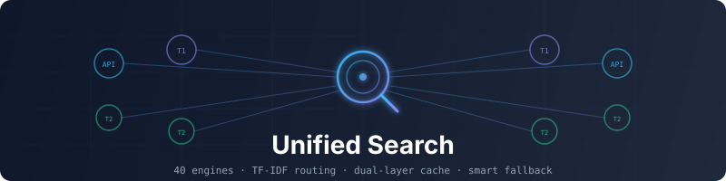

<p align="center">
  
</p>

<h3 align="center">Argo · 阿尔戈</h3>

<p align="center">
  给 Agent 用的统一搜索与证据核验。<br>
  不只返回链接，而是尽量给出<strong>能核验、能吸收</strong>的材料。
</p>

<p align="center">
  <a href="#这是什么">介绍</a> ·
  <a href="#快速开始">快速开始</a> ·
  <a href="#适用平台">适用平台</a> ·
  <a href="#能做什么">能力</a> ·
  <a href="#引擎与路由">引擎</a> ·
  <a href="#使用示例">示例</a> ·
  <a href="#安装与配置">配置</a> ·
  <a href="#版本记录">更新</a>
</p>

<p align="center">
  
  
  
  
  
</p>

---

## 这是什么

**Argo 是一套给 AI Agent 用的搜索基础设施。**

你问「贵州茅台股价」，会优先走 **A 股行情快照**（新浪 / 腾讯等），而不是扫一堆网页标题；问「AAPL 美股」，走美股专线；问「美国 CPI / 中国 GDP」，走宏观数据源；问「阿司匹林分子式」，走化合物库；问「transformer attention paper」，走 arXiv。更重要的是：它会尽量判断**哪些结果值得当真**——是不是搜索结果页壳、有没有数字和披露、多个域名是否说同一件事。

一句话：

> 产出不是「链接清单」，而是「证据候选 + 可信度分解」。

### 和「再包一层搜索 API」的差别

| 常见做法 | Argo |
|---------|------|
| 绑死一个引擎、一个 Key | 多引擎自动选路，免费优先、可配预算 |
| 啥问题都泛搜网页 | **垂直源优先**：行情、宏观、化学等先给答案型结果 |
| 搜完直接拼摘要 | 选择门槛 × 证据密度 × 时效 × 多源共识 |
| 引擎挂了整条链路挂 | 熔断、负缓存、降级到本地引擎或缓存 |
| 每次查询都重新打网 | 双层缓存（内存 + SQLite），热查询约 10ms 级 |
| 日常和研究一个慢 | **日常少开引擎、研究再放宽**（引擎分层 + combo 预算） |
| 只给链接 | 附带 selection / absorption / 引擎状态等字段 |
| Agent 上下文被长 JSON 撑爆 | MCP 响应可紧凑裁剪，snippet 可控 |

### 当前大致能力（v2.5.1）

- **约 110 个搜索源**：通用网页 + **金融行情 / 宏观数据 / 化学物种 / 图书档案** 等垂直源，配置真源在 `config.yaml`
- **16 个 MCP 工具**：搜索、研究、证据、消歧、抓取、截图、PDF、社交舆情一站挂上
- **垂直搜索更好用（本版重点）**：
  - **日常金融**：A 股快照、资金流、美股盘口类查询，能 early-stop，几百毫秒到两秒级常见
  - **宏观与汇率**：FRED、世界银行、国统局、欧统、汇率等，减少「搜中国 GDP 却回美国数据」类错位
  - **化学 / 物种 / 标准文档**：PubChem、GBIF、RFC 等窄域直达
  - **深度研究**：研究路径会 **抬高垂直源优先级**，但不锁死某一个源（boost，不是硬锁）
- **日常更快、研究更全**：`engine_policy` 统一分层——日常 combo 收紧，deep / research 再放开长尾源
- **语义路由 + 规则域**：TF-IDF 与正则域配合；低分回退通用引擎，避免误进垂直站
- **查询改写**：口语问题可改成更利于检索的表述；改写词**不会污染**路由域匹配
- **路由热路径缓存**：同一类查询重复路由接近亚毫秒级
- **证据两阶段**：Selection × Absorption；研究与消歧、抓取栈、熔断负缓存、MCP 紧凑响应仍在

### 举几个「问啥像啥」的例子

| 你这样问 | 大致会怎样 |
|----------|------------|
| 贵州茅台股价 | A 股行情域，优先快照源，够用就停 |
| AAPL / 美股盘前 | 美股域，与 A 股分流 |
| 美国 CPI、中国 GDP | 宏观数据域；非美国国别会优先世界银行等 |
| 阿司匹林 分子式 | 化学域 → PubChem 类答案 |
| 台积电估值分歧（深度研究） | 拆子问题 + 多源并行，金融垂直源被 boost 进来 |

```
查询
  │
  ├─ 意图消歧（可选）
  ├─ 查询改写（可选；路由仍看原始意图特征）
  ├─ 路由（域规则 + TF-IDF + 预算模式 + 热路径缓存）
  ├─ 多引擎召回（熔断 / 负缓存 / 并行）
  ├─ RRF 融合 + 可选精排
  ├─ 证据快评（权威 · 证据密度 · 时效 · 共识）
  └─ 统一 JSON（含 engine_outcomes，方便判断空结果原因）
```

---

## 为什么需要它

| 痛点 | Argo 的做法 |
|------|------------|
| 中文、金融、学术场景要换来换去 | 自动按域选引擎；行情 / 宏观 / 化学 / 知乎 / arXiv 有专线 |
| 问股价却只得到新闻标题 | 答案型垂直源 + early-stop，优先可吸收事实 |
| 摘要里有数，正文对不上 | 高后果场景建议再 `fetch` + `evidence`，不只信 snippet |
| 搜索结果页、跳转链被当成信源 | SERP / 跳转壳识别并降权 |
| 付费额度紧张 / 日常太慢 | 四档预算 + **日常 combo 条数限制**；研究再全开 |
| 重复问题反复等几秒 | 分级 TTL + 柔性命中（条数够可截断复用） |
| 引擎空转白等 | 熔断 + 短 TTL 负缓存 |
| 「苹果股价」却路由到购物站 | 查询改写与域匹配解耦，减少购物类误吸 |

---

## 快速开始

任选一种即可。**不依赖 npm 官方包**也能用最新版（v2.5.1 起以 **GitHub** 为安装真源；npm registry 上的旧包可能滞后，可不走）。

**零配置就能跑**：不配 API Key 时走免费引擎 + 本地 `local_*` 引擎；配了 Key 的源质量通常更好，没配则自动跳过。

### 方式一：一键脚本（推荐本机长期用，只要 git + Python）

```bash
curl -fsSL https://raw.githubusercontent.com/taxueseek/argo/main/scripts/install.sh | bash
```

装到指定目录、并挂 Skill 入口：

```bash
curl -fsSL https://raw.githubusercontent.com/taxueseek/argo/main/scripts/install.sh \
  | bash -s -- --home "$HOME/.local/share/argo" --link "$HOME/.claude/skills/argo"
```

验证：

```bash
python3 ~/.local/share/argo/scripts/search.py "贵州茅台股价" --json
python3 ~/.local/share/argo/scripts/search.py --list-engines
```

### 方式二：MCP 不装包，直接用 GitHub（推荐 Agent 快速挂载）

需要 **Node.js 18+** 和 **Python 3.10+**，首次执行一次：

```bash
pip3 install pyyaml
```

**启动 MCP（从 GitHub 拉最新，不走 npm 版本号）：**

```bash
npx -y github:taxueseek/argo
```

客户端配置示例（Claude Code / Cursor / Kimi 等）：

```json
{
  "mcpServers": {
    "argo": {
      "command": "npx",
      "args": ["-y", "github:taxueseek/argo"]
    }
  }
}
```

更稳、完全不依赖 Node 的写法：先装脚本（方式一），再指向本机 Python：

```json
{
  "mcpServers": {
    "argo": {
      "command": "python3",
      "args": ["/Users/你的用户名/.local/share/argo/scripts/mcp_server.py"]
    }
  }
}
```

Python 路径特殊时：`export ARGO_PYTHON=/path/to/python3`（仅 npx 入口会读）。

### 方式三：Release 源码包（离线 / 固定版本）

打开 [Releases](https://github.com/taxueseek/argo/releases)，下载 **`argo-2.5.1.tar.gz`** 或 zip：

```bash
tar -xzf argo-2.5.1.tar.gz
cd argo-2.5.1
pip3 install pyyaml
python3 scripts/search.py "Python asyncio" --json
python3 scripts/mcp_server.py   # 启动 MCP
```

### 方式四：git clone（开发 / 改源码）

```bash
git clone https://github.com/taxueseek/argo.git
cd argo
pip3 install pyyaml
bash scripts/install.sh --link ~/.claude/skills/argo   # 可选
python3 scripts/search.py --list-engines
```

配置完成后，Agent 会自动调用 `argo_search`、`argo_research`、`argo_evidence` 等工具。

### 方式五：挂到 Skill 目录（符号链接，单一真源）

磁盘上只保留一份 Argo 代码。需要出现在 Claude / 其他 Agent 约定目录时，用链接而不是复制：

```bash
# 单次指定（仓库根目录下执行）
python3 scripts/link_source.py --to ~/.claude/skills/argo
python3 scripts/link_source.py --to ~/.agents/skills/argo

# 或复制示例后编辑本机声明（installs.local.yaml 已 gitignore，不会进仓库）
cp installs.local.yaml.example installs.local.yaml
# 编辑 link_targets 后：
python3 scripts/link_source.py
python3 scripts/link_source.py --check
```

### 方式六：作为 Python 库调用

```python
import sys
sys.path.insert(0, "/path/to/argo/scripts")  # 换成你的安装路径
from search import super_search

result = super_search("Python asyncio", n=5, mode="fast")
for item in result["results"]:
    print(item["title"], item.get("credibility_fast"), item["url"])

result = super_search("黄金价格", engine="eastmoney", n=3, skip_cache=True)
```

也可以用内置 CLI 包装：

```bash
# 若已把 bin/argo 放进 PATH
argo search "Python asyncio"
argo research "2026 公募基金持仓结构变化"
argo evidence "某条待核实的说法"
```

---

## 适用平台

| 平台 | 接入方式 | 说明 |
|------|---------|------|
| **Claude Code** | MCP / Skill 链接 | `npx argo-search` 或 `mcp_server.py`；也可用 `link_source.py` 挂 Skill |
| **Kimi** | MCP Server | 同上 |
| **Grok Build** | MCP Server | 同上 |
| **Cursor** | MCP | 在 MCP 设置里加 command |
| **Cline / Continue** | MCP | 支持 MCP 的 IDE 插件均可 |
| **命令行** | `search.py` / `bin/argo` | 脚本、定时任务、人工排查 |
| **Python 项目** | `from search import super_search` | 库调用 |

### 安装后自检

```bash
python3 --version          # 需要 3.10+
python3 -c "import yaml; print('PyYAML OK')"
python3 -m pytest tests/test_unit.py -q   # 可选
python3 scripts/search.py --list-engines
```

---

## 能做什么

| 能力 | 说明 | 入口 |
|------|------|------|
| 统一搜索 | 路由 → 召回 → 融合 → 快评 | `search.py` / `argo_search` |
| 深度研究 | 拆子问题、多源采集、缺口提示 | `research.py` / `argo_research` |
| 可信度评估 | 权威 / 证据密度 / 时效 / 交叉验证 | `evidence.py` / `argo_evidence` |
| 意图消歧 | 多义词、品牌碰撞、策略建议 | `clarify.py` / `argo_clarify` |
| 页面抓取 | HTTP 优先，必要时浏览器降级 | `fetch_v3` / `argo_fetch` |
| 截图 / PDF | 页面截图、PDF 结构化提取 | `argo_screenshot` / `argo_pdf` |
| 站点爬取 / 提取 | 列表页、表格、元数据等 | `crawl` / `extract` |
| 社交与舆情 | 微博 / 小红书 / B 站 / Reddit / X 等 | 社交引擎 + `argo_social_*` |
| 健康与配额 | 引擎可用性、成本档位 | `health_check` / `quota` |

### 预算模式

| 模式 | 适合 | 行为 |
|------|------|------|
| `fast` | 简单问题、要速度 | 免费引擎优先，跳过付费精排 |
| `auto` | 默认日常 | 成本感知，质量与花费折中 |
| `deep` | 调研、综述 | 质量优先，可多用引擎 |
| `budget` | 额度紧 | 配额控制，用完降级 |

### 证据评分（简版）

```
selection  ≈ 域名权威，SERP/跳转链压到很低
absorption ≈ 数字 / 定义 / 对比 / 披露等证据密度
freshness  ≈ 发布时间（会忽略「2015 年以来」这类历史对比年）
综合       ≈ 0.40·selection + 0.35·absorption + 0.15·freshness + 0.10·引擎分
```

搜索结果里会带 `selection`、`absorption`、`credibility_fast`、`evidence_flags` 等字段，方便 Agent 直接排序。

### Agent 使用纪律（建议）

1. **高后果问题**（持仓、安全、是否属实）：search → 看快评分 → 对 top 结果 `fetch` → 再下结论
2. **数字**：写清口径，冲突时并列，不要硬合并
3. **搜索结果页 / 跳转链**：不要当正文信源
4. **社交帖**：当舆情与叙事，不当事实真值
5. **事实核查**：宁可多一两条分层查询（来源 / 对比 / 主体）

---

## 引擎与路由

当前配置里大约 **87** 个源（以 `config.yaml` 与 `--list-engines` 为准，会随版本增减）。

### 直连与垂类（节选）

| 引擎 | 场景 | 成本倾向 |
|------|------|----------|
| anysearch | 通用 / 技术 | 免费 |
| eastmoney | 股票 / 基金 | 免费 |
| zhihu / zhihu_global | 中文观点 / 评测 | API |
| zhihu_hot | 知乎热榜（日配额约 100） | API |
| arxiv / semantic_scholar / openalex | 学术 | 免费为主 |
| github / stackoverflow / pypi / npm | 代码与包 | 视配置 |
| byted / bocha / metaso / octen | 中文网页 / AI 搜索 | API / 低成本 |
| tavily / felo / exa | 国际 / 语义 | 付费或额度 |
| wechat_sogou | 公众号检索 | 免费 |
| cls_telegraph / ths_hot / em_global_news / jin10 | 财经快讯 | 免费为主 |
| twitter / reddit / xiaohongshu / bilibili / weibo | 社交 UGC | 免费（部分需登录） |
| finviz / seeking_alpha / polymarket | 海外金融与预测市场 | 视配置 |
| huggingface / mdn / models_dev | 模型与开发文档 | 免费为主 |

### 本地零成本层（`local_*`）

不依赖独立的 SearXNG 服务。主路径用进程内 HTML / RSS / JSON 解析（如 `local_bing`、`local_sogou`、`local_arxiv` 等），由路由按语言与主题展开，并参与 RRF 融合。

### 路由怎么选

```
查询
  → 特征（中英比例、是否对比、是否技术词…）
  → 正则域（股价 / 基金 / 学术 / 代码…）
  → TF-IDF 语义分（过低则回退通用引擎）
  → 预算过滤 + 语言补充源
  → engines_combo（结果可缓存，重复路由极快）
```

金融示例仍会进东财；开发文档类不会再因为「零分第一名」误进东财。查询改写只影响**检索用词**，不拿改写结果去重新贴域标签。

---

## 使用示例

### 金融

```bash
$ python3 scripts/search.py "贵州茅台股价" --explain
# 典型：命中 stock_query → 东方财富为主
```

### 学术

```bash
$ python3 scripts/search.py "transformer attention mechanism paper" --json
# domain 常为 academic，引擎组合含 arxiv 等
```

### 研究与核验

```bash
python3 scripts/research.py "2026 公募基金二季报 持仓结构" --depth deep --json

python3 scripts/search.py "同一查询" --json | \
  python3 scripts/evidence.py "同一查询" --stdin --json
```

### MCP 工具一览（10）

| 工具 | 用途 |
|------|------|
| `argo_search` | 统一搜索 |
| `argo_local_search` | 本地文件搜索（非联网） |
| `argo_research` | 深度研究（含 social-sentiment 模式） |
| `argo_evidence` | 可信度评估 |
| `argo_clarify` | 意图消歧 |
| `argo_fetch` | 智能抓取（mode=extract 结构化提取） |
| `argo_crawl` | 站点爬取 |
| `argo_screenshot` | 页面截图 |
| `argo_pdf` | PDF 提取 |
| `argo_social_search` | 多平台社交搜索（mode=sentiment 舆情聚合） |

---

## 安装与配置

### 环境要求

| 项目 | 要求 |
|------|------|
| Python | 3.10+（命令行与 MCP 核心） |
| 依赖 | `pip install pyyaml`（仅此一个硬依赖） |
| Node.js | **仅**在使用 `npx argo-search` 时需要 18+ |
| SearXNG | 不需要（内置本地引擎替代） |

### API Key（全部可选）

不配置则跳过对应引擎，免费引擎自动兜底。**请用环境变量**，不要把真实 Key 写进仓库或贴到 Issue。

```bash
# 推荐（提升搜索质量）
export TAVILY_API_KEY="你的密钥"
export BOCHA_API_KEY="你的密钥"
export METASO_API_KEY="你的密钥"
export ZHIHU_ACCESS_SECRET="你的密钥"

# 可选
export BRAVE_API_KEY="你的密钥"
export FELO_API_KEY="你的密钥"
export GITHUB_TOKEN="你的密钥"
export WEB_SEARCH_API_KEY="你的密钥"
export ANYSEARCH_API_KEY="你的密钥"
export OCTEN_API_KEY="你的密钥"
```

`config.yaml` 里只写 `{ENV_NAME}` 占位，不会提交明文密钥。

### 缓存配置

默认写在用户目录下的 SQLite（见 `config.yaml` 的 `cache.db_path`，一般为 `~/.cache/unified-search/cache.db`）。

| 类型 | 大致 TTL | 说明 |
|------|----------|------|
| 金融 | 约 5 分钟 | 股价等实时数据 |
| 新闻 / 实时 | 约 10–15 分钟 | 快讯类 |
| 通用 | 约 1 小时 | 非时效域可拉长 |
| 研究 / 常青 | 约 2–24 小时 | 学术类 |
| 空结果 | 很短 | 避免把失败固化成「没结果」 |

缓存键会区分预算模式与搜索深度；请求条数更少时，可用已有更多结果做柔性命中。

### 常见问题

**Q：不配 API Key 能用吗？**

A：能。内置大量本地零成本引擎和多个免费 API 源，不配 Key 时自动走免费路径。

**Q：安装脚本和 npx 有什么区别？**

A：安装脚本适合固定装在本机、改配置、挂 Skill；npx 适合快速把 MCP 挂进 Agent，少动文件系统。两者底层都是同一套 Python 代码。

**Q：如何确认引擎是否正常？**

A：`python3 scripts/search.py --list-engines`，或 `python3 scripts/search.py "测试" --explain`。

**Q：MCP 和命令行有什么区别？**

A：底层能力相同。MCP 适合 Agent 自动调用；命令行适合脚本和人工排查。

**Q：会不会在仓库里复制多份代码？**

A：不会。推荐「一份真源 + 符号链接」。旧的 `sync_installs.py` 多副本同步已废弃，请用 `link_source.py`。

---

## 目录结构（简）

```
argo/
├── README.md
├── SKILL.md                 # Agent 技能说明
├── package.json             # npx / npm 入口（argo-search）
├── bin/argo.js              # Node 启动 MCP
├── bin/argo                 # Python 子命令 CLI
├── config.yaml              # 引擎与域配置（真源）
├── backends/                # 注册表、配额、中文信源表（可由脚本派生）
├── scripts/
│   ├── install.sh           # 一键安装
│   ├── link_source.py       # Skill 符号链接
│   ├── search.py / route.py / cache.py / evidence.py …
│   ├── mcp_server.py / mcp_tools.py / mcp_payload.py
│   └── engines*.py          # 引擎实现（按域拆分）
├── sub-skills/local-search/ # 本地零成本引擎
├── tests/
└── docs/
```

---

## 设计取舍

1. **先服务 Agent 吸收，再谈链接数量。**
2. **免费与本地优先，付费可选增强。**
3. **失败要可观测**：空结果、超时、熔断分开标，不静默吞掉。
4. **配置驱动扩引擎**，`config.yaml` 为单一真源。
5. **单一真源安装**：链接入口、不 rsync 多副本。
6. **不把社交当真理库**；平台内高级排序以原生能力为准时，Argo 做扩维与核验更合适。

---

## CLI 常用参数

```
python3 scripts/search.py [选项] 查询词

  --engine, -e       引擎，默认 auto
  --max-results, -n  条数，默认 5
  --depth, -d        fast | balanced | deep
  --mode             fast | auto | deep | budget
  --no-cache         跳过缓存
  --explain          打印路由说明
  --json             JSON 输出
  --timeout, -t      超时秒数
  --list-engines     列出引擎
```

---

## 适用场景

- Claude Code / Grok Build / Codex / Kimi 等 **Agent 的搜索后端**
- 脚本与流水线里需要 **可复现、可缓存** 的检索
- 中文事实核查、金融公开信息、学术与代码资料的 **多源对照**

不太适合单独承担：平台内 X 的高级互动定榜、需要长期养服务的最大召回聚合器（已用内嵌本地引擎替代外挂 SearXNG 主路径）。

---

## 版本记录

| 版本 | 说明 |
|------|------|
| **v2.5.1** | 约 110 源；金融/宏观/化学等垂直答案源加厚；引擎分层 + combo 预算（日常快、研究全）；研究 boost 不锁死；回归 harness；详见 [发布说明](docs/RELEASE_NOTES_v2.5.1.md) |
| **v2.5.0** | 安装脚本 + npx；查询改写与路由解耦；路由热路径缓存；MCP 紧凑响应；engines/MCP 模块拆分；介绍页重写 |
| **v2.4.0** | 路由低分回退与社交误吸过滤；缓存 depth / 柔性命中；熔断与负缓存；`engine_outcomes`；RRF 共识源；fetch URL 缓存 |
| **v2.2–v2.3** | 证据两阶段、中文信源表、content_signals、fetch 栈、引擎扩充、MCP 能力增强 |
| **v2.1** | 社交引擎层（多平台 UGC） |
| **v1.x** | 统一命名为 Argo，多引擎路由与双层缓存成型 |

更细说明见 `docs/RELEASE_NOTES_v2.5.1.md` 与 `docs/OPTIMIZATION_ROADMAP_v2.4.md`。

---

## 贡献

欢迎提 Issue 与 Pull Request。改路由或证据逻辑时，请尽量补对应测试（`tests/`）或跑一遍：

```bash
python3 -m pytest tests/test_unit.py tests/test_evidence_v22.py -q
python3 scripts/ab_eval_p0p1.py   # 可选，含在线实测
```

提交前请确认：不含真实 API Key、本机绝对路径、账号 cookie 等敏感信息。本机 Skill 路径请写在 `installs.local.yaml`（已忽略），示例见 `installs.local.yaml.example`。

## License

MIT License © 2026 [taxueseek](https://github.com/taxueseek)

---

> 好的搜索不是让你看得更多，是让你更敢下结论——以及知道什么时候还不该下结论。
